# Destina Genomica — Chemical Compounds & Reagents Catalogue
**Technical Master File & Compound Specification Index**  
*Document Ref: DESTINA-CAT-CHEM-2026-V4 | Revision 4.0 | ISO 9001:2015 & ISO 13485:2016 Compliant*  
*Authors: Dr. Francisco Javier López-Delgado & Dr. Juan José Díaz-Mochón | DestiNA Genomics S.L.*

---

## Executive Summary & Platform Architecture
This official repository contains the comprehensive chemical library of **81 validated molecular entities** utilized across DestiNA Genomics platforms. The catalogue encompasses:
1. **Standard Achiral PNA Monomers & Backbone**: Uncharged aminoethylglycine (Aeg) structural foundation and nucleobase monomers (Fmoc-PNA-T, A(Bhoc), C(Bhoc), G(Bhoc)).
2. **Chiral γ-L-Glutamyl PNA Platform**: Pre-organized right-handed helical monomers (Aglu, Cglu, Gglu, Tglu), the corresponding enantiopure γ-L-Glutamic backbone, and the abasic blank unit (*GL*).
3. **Chiral γ-Serine PNA Platform**: Enantiopure (S)-L and (R)-D serine pseudopeptide backbones, synthetic intermediates (alcohols, aldehydes), and abasic blank monomers (*L-Ser* and *D-Ser*).
4. **SMART Nucleobase Platform (PT-SQ-001 Protocol)**: Complete six-step synthetic sequence from 5-iodocytosine to SMART Cytosine REX PEG12-Biotin (SC-RP12-B), including all isolated reaction intermediates.
5. **PEGylated, Cationic & Diaminopropionic PNA Monomers**: Advanced monomers for charge tuning and biophysical modulation (Cpeg, Tpeg, Clys, Tlys, *L-DAPA*, *D-DAPA*, Hy).
6. **Solid-Phase Peptide Synthesis (SPPS) Reagents & Cleavage Cocktails**: Coupling activators, base scavengers, cleavage acids, and resin linkers.
7. **Specialized Synthetic Reagents & Catalysts**: Hypervalent iodine oxidants (DMP), selective hydrides (NaBH₃CN), alkyl chloroformates (IBCF), and coupling additives (DhBtOH, DCC).

---

## Analytical Quality Control & Acceptance Standards
All synthesized batches and incoming raw materials undergo rigorous analytical validation in accordance with ISO 9001:2015 and ISO 13485:2016 standards:

| Quality Parameter | Analytical Technique | Acceptance Specification | Operational Significance |
| :--- | :--- | :--- | :--- |
| **Chromatographic Purity** | RP-HPLC (Poroshell 120 EC-C18, CBU-2) | **≥ 90.0%** (Main peak area / Total area) | Guarantees coupling efficiency ≥99.5% in automated SPPS |
| **Enantiomeric Excess (ee)** | Chiral HPLC (Cellulose-1, 250 × 4.6 mm) | **100.0% ee** (Baseline enantiomer separation) | Prevents left-handed helical inversion and mismatch destabilization |
| **Mass Confirmation** | High-Resolution Mass Spec (HRMS) | **Theoretical Mass ± 10 ppm** | Unambiguous structural identity verification before release |
| **Physical Appearance** | Visual Inspection | Clear, limpid solution at 0.2 M in NMP/DMF | Prevents nozzle clogging on Intavis MultiPep synthesizers |

---

## Master Analytical Retention Times (DSTNA_CBU_2 & Chiral HPLC)
Analytical RP-HPLC method **DSTNA_CBU_2** on Agilent Poroshell 120 EC-C18 (4.6 × 50 mm, 2.7 µm), Flow: 1.0 mL/min, Gradient: 0.1% TFA in H₂O to 0.1% TFA in ACN (5% to 95% over 7 min). Chiral HPLC performed on Cellulose-1 (250 × 4.6 mm).

| Monomer Code | Chemical Descriptor | RP-HPLC Tr (min) | Chiral Column / Mobile Phase | Chiral Tr (min) | Enantiomeric Excess (ee) |
| :--- | :--- | :--- | :--- | :--- | :--- |
| **T** | Fmoc-PNA-T-OH | 5.105 | - | - | Achiral |
| **Tpeg** | Fmoc-γ-(mini-PEG)-T-PNA-OH | 5.223 | - | - | Stereocontrolled |
| **X** | Fmoc-Aeg(Boc)-OH (Abasic Aeg) | 5.439 | - | - | Achiral |
| **Tlys** | Fmoc-γ-L-Lys(Boc)-T-PNA-OH | 5.627 | - | - | Stereocontrolled |
| **Tglu** | Fmoc-γ-L-Tglu-PNA-COOH | 5.706 | Cellulose-1 (iPrOH:Hex 20:80, 1 mL/min) | 37.523 | **100% ee** |
| **A** | Fmoc-PNA-A(Bhoc)-OH | 5.777 | - | - | Achiral |
| **G** | Fmoc-PNA-G(Bhoc)-OH | 5.804 | - | - | Achiral |
| **Hy** | Fmoc-Hy-OH (Hydroxyethylglycine) | 5.841 | - | - | Achiral |
| **\*_\*** | Standard DGL Spacer | 5.927 | - | - | Standard spacer |
| **C** | Fmoc-PNA-C(Bhoc)-OH | 5.998 | - | - | Achiral |
| **Cpeg** | Fmoc-γ-(mini-PEG)-C(Bhoc)-PNA-OH | 6.073 | - | - | Stereocontrolled |
| **Aglu** | Fmoc-γ-L-A(Bhoc)glu-PNA-COOH | 6.210 | Cellulose-1 (iPrOH:Hex 25:75, 1 mL/min) | 32.199 | **100% ee** |
| **\*L-DAPA\*** | Fmoc-γ-L-DAPA(Boc)-Blank-PNA-COOH | 6.232 | Cellulose-1 | - | Enantiopure |
| **\*D-DAPA\*** | Fmoc-γ-D-DAPA(Boc)-Blank-PNA-COOH | 6.232 | Cellulose-1 | - | Enantiopure |
| **Gglu** | Fmoc-γ-L-G(Bhoc)glu-PNA-COOH | 6.298 | Cellulose-1 (iPrOH:Hex 30:70, 1 mL/min) | 47.782 | **100% ee** |
| **Clys** | Fmoc-γ-L-Lys(Boc)-C(Bhoc)-PNA-OH | 6.389 | - | - | Stereocontrolled |
| **\*L-Ser\*** | Blank Monomer (L-Serine derivative) | 6.413 | Cellulose-1 | - | **100% ee** |
| **\*D-Ser\*** | Blank Monomer (D-Serine derivative) | 6.459 | Cellulose-1 | - | **100% ee** |
| **Cglu** | Fmoc-γ-L-C(Bhoc)glu-PNA-COOH | 6.462 | Cellulose-1 (MeOH:EtOH:Hex 5:20:75, 1 mL/min) | 17.682 | **100% ee** |
| **\*GL\*** | Blank Monomer (Boc-γ-L-Glu-PNA-COOH) | 6.504 | Cellulose-1 (iPrOH:Hex 25:75, 0.5 mL/min) | 14.929 | **100% ee** |
| **γ-L-Glu Backbone** | DGSL-g-Glu-PNA-COOMe | - | Cellulose-1 (iPrOH:Hex 20:80, 0.5 mL/min) | 25.728 | **100% ee** |
| **γ-D-Glu Backbone** | DGSL-g-D-Glu-PNA-COOMe | - | Cellulose-1 (iPrOH:Hex 20:80, 0.5 mL/min) | 48.501 | **100% ee** |

---

## Reaction Schemes & Synthetic Cascades

### 1. Synthetic Sequence for SMART Cytosine REX PEG12-Biotin (PT-SQ-001)
The production of SC-RP12-B follows a two-stage, six-step controlled pathway (Author: Dr. Francisco Javier López-Delgado):

```mermaid
graph TD
    A["4-amino-5-iodopyrimidin-2(1H)-one<br/>(5-Iodocytosine, CAS 1122-44-7)"] -->|Cs₂CO₃, 2-bromo-1,1-diethoxyethane<br/>DMF, 65 °C (Step 1)| B["Compound 1: 5-Iodo-Cytosine Acetal<br/>(MW 353.16 Da)"]
    B -->|Pd(PPh₃)₄, CuI, Et₃N<br/>N-propargyltrifluoroacetamide, DMF, 60 °C (Step 2)| C["Compound 2: 5-PropargylamideTfa-Cytosine Acetal<br/>(MW 376.34 Da)"]
    C -->|H₂, Pd/C 10%<br/>MeOH, rt, 4-6 bar (Step 3)| D["Compound 3: 5-PropylamideTfa-Cytosine Acetal<br/>(C-REX-NHTfa, MW 380.37 Da)"]
    D -->|30% NH₄OH (aq)<br/>rt, 48 h (Step 4)| E["Compound 4: AC-REX-NH₂<br/>(Universal C-REX Amine, MW 284.36 Da)"]
    E -->|NHS-PEG12-Biotin, Et₃N<br/>DMF, rt, 16 h (Step 5)| F["Compound 5: AC-RP12-B<br/>(Acetal Cytosine-REX-PEG12-Biotin, MW 1110.37 Da)"]
    F -->|10% Aqueous TFA<br/>rt, 2-3 h (Step 6)| G["Compound 6: SC-RP12-B<br/>(Active Aldehyde SMART Cytosine, MW 1036.25 Da)"]
```

### 2. Synthetic Sequence for γ-Glutamic Backbone & Monomers (PS_Gamma Glu & SOP_EE)
```mermaid
graph TD
    S1["Fmoc-L-Glu(OtBu)-ol<br/>(CAS 153815-59-9)"] -->|Dess-Martin Periodinane (DMP)<br/>Wet DCM, 0-5 °C (Scheme 1, Step 1)| S2["DGSL-Fmoc-L-Glu(OtBu)-H<br/>(Chiral Aldehyde, ee = 100%)"]
    S2 -->|Glycine methyl ester·HCl, DIPEA<br/>NaBH₃CN, AcOH, MeOH, 0 °C to rt (Scheme 1, Step 2)| S3["γ-L-Glutamic Backbone<br/>(DGSL-g-Glu-PNA-COOMe, Tr = 25.7 min)"]
    S3 -->|NB-CH₂COOH, DCC, DhBtOH<br/>DMF, 0 °C to rt (Scheme 2, Step 3)| S4["DGSL-NB-γ-Glu-PNA-COOMe<br/>(NB = T, Cbhoc, Abhoc, Gbhoc)"]
    S4 -->|NaOH, CaCl₂<br/>iPrOH/H₂O (7:3), 0 °C to rt (Scheme 2, Step 4)| S5["Enantiopure PNA Monomers<br/>(Tglu, Cglu, Aglu, Gglu)"]
    S3 -->|Boc₂O, TEA<br/>THF, rt (Scheme 3, Step 5)| S6["DGSL-Boc-γ-Glu-PNA-COOMe"]
    S6 -->|NaOH, CaCl₂<br/>iPrOH/H₂O (7:3), rt (Scheme 3, Step 6)| S7["Blank Monomer *GL*<br/>(Boc-γ-L-Glu-PNA-COOH, ee = 100%)"]
```

### 3. Synthetic Sequence for γ-Serine Backbone & Monomers (PS_Gamma Ser)
```mermaid
graph TD
    SE1["Fmoc-L/D-Ser(tBu)-OH<br/>(Starting Carboxylic Acid 1a-b)"] -->|IBCF, NMM, DME, 0 °C<br/>NaBH₄, H₂O (Scheme 1, Step 1)| SE2["Fmoc-L/D-Ser(tBu)-ol<br/>(Alcohol 2a-b)"]
    SE2 -->|Dess-Martin Periodinane (DMP)<br/>Wet DCM, 0-5 °C (Scheme 1, Step 2)| SE3["Fmoc-L/D-Ser(tBu)-H<br/>(Aldehyde 3a-b)"]
    SE3 -->|Gly-OMe·HCl, DIPEA, NaBH₃CN<br/>AcOH, MeOH, 0 °C to rt (Scheme 1, Step 3)| SE4["L/D-γ-Serine Backbone<br/>(Methyl Ester 4a-b)"]
    SE4 -->|Boc₂O, TEA<br/>THF, rt (Scheme 2, Step 4)| SE5["L/D-γ-Boc-Ser-PNA-OMe<br/>(Compound 5a-b)"]
    SE5 -->|NaOH, CaCl₂<br/>iPrOH/H₂O (7:3), rt (Scheme 2, Step 5)| SE6["Blank Monomers *L-Ser* & *D-Ser*<br/>(Boc-γ-Ser(tBu)-PNA-COOH 6a-b)"]
```

---

## Comprehensive Library Index (81 Chemical Entities)

| Code | Compound Name | Primary Class | Formula | MW (Da) | CAS / Document | SMILES |
| :--- | :--- | :--- | :--- | :--- | :--- | :--- |
| **DST-PNA-001** | N-(2-Aminoethyl)glycine (Aeg Backbone) | Standard Achiral PNA Monomers & Structural Backbone | C₄H₁₀N₂O₂ | 118.14 | - | `NCCNCC(=O)O` |
| **DST-PNA-002** | Fmoc-PNA-T-OH (Thymine PNA Monomer) | Standard Achiral PNA Monomers & Structural Backbone | C₂₆H₂₆N₄O₇ | 506.52 | - | `Cc1cn(CC(=O)N(CCNC(=O)OCC2c3...` |
| **DST-PNA-003** | Fmoc-PNA-A(Bhoc)-OH (Adenine PNA Monomer) | Standard Achiral PNA Monomers & Structural Backbone | C₄₀H₃₅N₇O₇ | 725.76 | - | `O=C(O)CN(CCNC(=O)OCC1c2ccccc...` |
| **DST-PNA-004** | Fmoc-PNA-C(Bhoc)-OH (Cytosine PNA Monomer) | Standard Achiral PNA Monomers & Structural Backbone | C₃₉H₃₅N₅O₈ | 701.74 | - | `O=C(O)CN(CCNC(=O)OCC1c2ccccc...` |
| **DST-PNA-005** | Fmoc-PNA-G(Bhoc)-OH (Guanine PNA Monomer) | Standard Achiral PNA Monomers & Structural Backbone | C₄₀H₃₅N₇O₈ | 741.76 | - | `O=C(O)CN(CCNC(=O)OCC1c2ccccc...` |
| **DST-GAM-001** | Fmoc-A(Bhoc)-γ-Glu-OH (Chiral γ-L-Glutamyl PNA Adenine) | Chiral γ-L-Glutamyl PNA Monomers | C₄₇H₄₇N₇O₉ | 853.93 | - | `CC(C)(C)OC(=O)CC[C@@H](CN(CC...` |
| **DST-GAM-002** | Fmoc-Cglu(Bhoc)-OH (Chiral γ-L-Glutamyl PNA Cytosine) | Chiral γ-L-Glutamyl PNA Monomers | C₄₆H₄₇N₅O₁₀ | 829.91 | - | `CC(C)(C)OC(=O)CC[C@@H](CN(CC...` |
| **DST-GAM-003** | Fmoc-Gglu(Bhoc)-OH (Chiral γ-L-Glutamyl PNA Guanine) | Chiral γ-L-Glutamyl PNA Monomers | C₄₇H₄₇N₇O₁₀ | 869.93 | - | `CC(C)(C)OC(=O)CC[C@@H](CN(CC...` |
| **DST-GAM-004** | Fmoc-T-γ-Glu-OH (Chiral γ-L-Glutamyl PNA Thymine) | Chiral γ-L-Glutamyl PNA Monomers | C₃₃H₃₈N₄O₉ | 634.69 | - | `Cc1cn(CC(=O)N(CC(=O)O)C[C@H]...` |
| **DST-DGL-001** | Fmoc-*L-Ser*-OH (Chiral Abasic DGL PNA Monomer) | Abasic DGL Monomers (Dynamic Chemical Labeling) | C₂₉H₃₈N₂O₇ | 526.63 | - | `CC(C)(C)OC[C@@H](CN(CC(=O)O)...` |
| **DST-DGL-002** | Fmoc-Aeg-OH (Achiral Abasic DGL Monomer) | Abasic DGL Monomers (Dynamic Chemical Labeling) | C₁₉H₂₀N₂O₄ | 340.38 | - | `O=C(O)CNCCNC(=O)OCC1c2ccccc2...` |
| **DST-SMART-001** | SMART C REX PEG12-Biotin (Aldehyde Cytosine Probe) | Functionalized SMART Probes (Dynamic Chemical Labeling) | C₄₆H₈₁N₇O₁₇S | 1036.25 | - | `Nc1nc(=O)n(CC=O)cc1CCCNC(=O)...` |
| **DST-SPC-001** | Fmoc-AEEA-OH (Fmoc-EAAE-OH / Mini-PEG-2 Spacer) | Linkers, Spacers & Solid Supports | C₂₁H₂₃NO₆ | 385.42 | - | `O=C(O)COCCOCCNC(=O)OCC1c2ccc...` |
| **DST-RES-001** | Fmoc-Rink Amide Linker (RAM Linker) | Linkers, Spacers & Solid Supports | C₃₂H₂₉NO₆ | 523.59 | - | `COc1cc(OC)c(c(O)c1)C(c1ccc(O...` |
| **DST-RNA-001** | Adenosine 5'-Monophosphate (AMP / RNA Monomer A) | Target RNA Ribomononucleotides | C₁₀H₁₄N₅O₇P | 347.22 | - | `Nc1ncnc2c1ncn2[C@@H]1O[C@H](...` |
| **DST-RNA-002** | Guanosine 5'-Monophosphate (GMP / RNA Monomer G) | Target RNA Ribomononucleotides | C₁₀H₁₄N₅O₈P | 363.22 | - | `Nc1nc2c(ncn2[C@@H]2O[C@H](CO...` |
| **DST-RNA-003** | Cytidine 5'-Monophosphate (CMP / RNA Monomer C) | Target RNA Ribomononucleotides | C₉H₁₄N₃O₈P | 323.20 | - | `Nc1ccn([C@@H]2O[C@H](COP(=O)...` |
| **DST-RNA-004** | Uridine 5'-Monophosphate (UMP / RNA Monomer U) | Target RNA Ribomononucleotides | C₉H₁₃N₂O₉P | 324.18 | - | `O=c1ccn([C@@H]2O[C@H](COP(=O...` |
| **DST-REA-001** | Oxyma Pure (Coupling Activator) | Solid-Phase Coupling, Activation & Capping Reagents | C₅H₆N₂O₃ | 142.11 | - | `CCOC(=O)C(C#N)=NO` |
| **DST-REA-002** | DIC (N,N'-Diisopropylcarbodiimide) | Solid-Phase Coupling, Activation & Capping Reagents | C₇H₁₄N₂ | 126.20 | - | `CC(C)N=C=NC(C)C` |
| **DST-REA-003** | Piperidine | Solid-Phase Coupling, Activation & Capping Reagents | C₅H₁₁N | 85.15 | - | `C1CCNCC1` |
| **DST-REA-004** | 2,6-Lutidine | Solid-Phase Coupling, Activation & Capping Reagents | C₇H₉N | 107.16 | - | `Cc1cccc(C)n1` |
| **DST-REA-005** | Acetic Anhydride (Ac₂O) | Solid-Phase Coupling, Activation & Capping Reagents | C₄H₆O₃ | 102.09 | - | `CC(=O)OC(C)=O` |
| **DST-CLV-001** | Trifluoroacetic Acid (TFA) | Cleavage Cocktails, Scavengers & Peptides | C₂HF₃O₂ | 114.02 | - | `O=C(O)C(F)(F)F` |
| **DST-CLV-002** | Triisopropylsilane (TIS) | Cleavage Cocktails, Scavengers & Peptides | C₉H₂₂Si | 158.36 | - | `CC(C)[SiH](C(C)C)C(C)C` |
| **DST-CLV-003** | Water (Milli-Q Grade) | Cleavage Cocktails, Scavengers & Peptides | H₂O | 18.02 | - | `O` |
| **DST-CLV-004** | Diethyl Ether | Cleavage Cocktails, Scavengers & Peptides | C₄H₁₀O | 74.12 | - | `CCOCC` |
| **DST-PEP-001** | Fmoc-L-Arg(Pbf)-OH (Protected L-Arginine) | Cleavage Cocktails, Scavengers & Peptides | C₃₄H₄₀N₄O₇S | 648.78 | - | `Cc1c(C)c2c(c(S(=O)(=O)NC(=N)...` |
| **DST-SOL-001** | N-Methyl-2-pyrrolidone (NMP) | Synthesis & HPLC Grade Process Solvents | C₅H₉NO | 99.13 | - | `CN1CCCC1=O` |
| **DST-SOL-002** | N,N-Dimethylformamide (DMF) | Synthesis & HPLC Grade Process Solvents | C₃H₇NO | 73.09 | - | `CN(C)C=O` |
| **DST-SOL-003** | Dichloromethane (DCM) | Synthesis & HPLC Grade Process Solvents | CH₂Cl₂ | 84.93 | - | `ClCCl` |
| **DST-SOL-004** | Methanol (MeOH) | Synthesis & HPLC Grade Process Solvents | CH₄O | 32.04 | - | `CO` |
| **DST-SOL-005** | Acetonitrile (ACN) | Synthesis & HPLC Grade Process Solvents | C₂H₃N | 41.05 | - | `CC#N` |
| **DST-SOL-006** | Dimethyl Sulfoxide (DMSO) | Synthesis & HPLC Grade Process Solvents | C₂H₆OS | 78.14 | - | `CS(C)=O` |
| **DST-MS-001** | Sinapic Acid (Sinapinic Acid) | Analytical Standards, Reporters & Byproducts | C₁₁H₁₂O₅ | 224.21 | - | `COc1cc(/C=C/C(=O)O)cc(OC)c1O` |
| **DST-FL-001** | FITC (Fluorescein 5-Isothiocyanate) | Analytical Standards, Reporters & Byproducts | C₂₁H₁₁NO₅S | 389.39 | - | `O=C1OC2(c3ccc(O)cc3Oc3cc(O)c...` |
| **DST-FL-002** | Rhodamine B | Analytical Standards, Reporters & Byproducts | C₂₈H₃₀N₂O₃ | 442.56 | - | `CCN(CC)c1ccc2c(c1)Oc1cc(N(CC...` |
| **DST-BYP-001** | Dibenzofulvene (DBF) | Analytical Standards, Reporters & Byproducts | C₁₄H₁₀ | 178.23 | - | `C=C1c2ccccc2-c2ccccc21` |
| **DST-BAS-001** | Adenine (A) | Analytical Standards, Reporters & Byproducts | C₅H₅N₅ | 135.13 | - | `Nc1ncnc2[nH]cnc12` |
| **DST-BAS-002** | Cytosine (C) | Analytical Standards, Reporters & Byproducts | C₄H₅N₃O | 111.10 | - | `Nc1cc[nH]c(=O)n1` |
| **DST-BAS-003** | Guanine (G) | Analytical Standards, Reporters & Byproducts | C₅H₅N₅O | 151.13 | - | `Nc1nc2[nH]cnc2c(=O)[nH]1` |
| **DST-BAS-004** | Thymine (T) | Analytical Standards, Reporters & Byproducts | C₅H₆N₂O₂ | 126.11 | - | `Cc1c[nH]c(=O)[nH]c1=O` |
| **DST-SMT-001** | 5-Iodocytosine (4-Amino-5-iodopyrimidin-2(1H)-one) | SMART Probe Synthetic Intermediates & Reagents (PT-SQ-001) | C₄H₄IN₃O | 237.00 | 1122-44-7 | `Nc1nc(=O)[nH]cc1I` |
| **DST-SMT-002** | Bromoacetaldehyde Diethyl Acetal (2-Bromo-1,1-diethoxyethane) | SMART Probe Synthetic Intermediates & Reagents (PT-SQ-001) | C₆H₁₃BrO₂ | 197.07 | 2032-35-1 | `CCOC(CBr)OCC` |
| **DST-SMT-003** | 5-Iodo-Cytosine Acetal (Compound 1) | SMART Probe Synthetic Intermediates & Reagents (PT-SQ-001) | C₁₀H₁₆IN₃O₃ | 353.16 | - | `CCOC(CN1C=C(I)C(N)=NC1=O)OCC` |
| **DST-SMT-004** | N-Propargyltrifluoroacetamide (2,2,2-Trifluoro-N-(prop-2-yn-1-yl)acetamide) | SMART Probe Synthetic Intermediates & Reagents (PT-SQ-001) | C₅H₄F₃NO | 151.09 | 14719-21-2 | `O=C(NCC#C)C(F)(F)F` |
| **DST-SMT-005** | 5-PropargylamideTfa-Cytosine Acetal (Compound 2) | SMART Probe Synthetic Intermediates & Reagents (PT-SQ-001) | C₁₅H₁₉F₃N₄O₄ | 376.34 | - | `CCOC(CN1C=C(C#CCNC(=O)C(F)(F...` |
| **DST-SMT-006** | 5-PropylamideTfa-Cytosine Acetal / C-REX-NHTfa (Compound 3) | SMART Probe Synthetic Intermediates & Reagents (PT-SQ-001) | C₁₅H₂₃F₃N₄O₄ | 380.37 | - | `CCOC(CN1C=C(CCCNC(=O)C(F)(F)...` |
| **DST-SMT-007** | AC-REX-NH2 (Compound 4 / Cytosine REX NH2 Acetal) | SMART Probe Synthetic Intermediates & Reagents (PT-SQ-001) | C₁₃H₂₄N₄O₃ | 284.36 | - | `CCOC(CN1C=C(CCCN)C(N)=NC1=O)...` |
| **DST-SMT-008** | NHS-PEG12-Biotin (Biotin-dPEG12-NHS Ester) | SMART Probe Synthetic Intermediates & Reagents (PT-SQ-001) | C₄₁H₇₂N₄O₁₈S | 941.10 | 365441-71-0 | `O=C(ON1C(=O)CCC1=O)CCOCCOCCO...` |
| **DST-SMT-009** | AC-RP12-B (Compound 5 / Acetal Cytosine-REX-PEG12-Biotin) | SMART Probe Synthetic Intermediates & Reagents (PT-SQ-001) | C₅₀H₉₁N₇O₁₈S | 1110.38 | - | `CCOC(CN1C=C(CCCNC(=O)CCOCCOC...` |
| **DST-GLU-001** | Fmoc-L-Glu(OtBu)-ol | γ-Chiral Glutamic PNA Platform (PS_Gamma Glu & SOP_EE) | C₂₄H₂₉NO₅ | 411.50 | 153815-59-9 | `CC(C)(C)OC(=O)CC[C@@H](CO)NC...` |
| **DST-GLU-002** | DGSL-Fmoc-L-Glu(OtBu)-H | γ-Chiral Glutamic PNA Platform (PS_Gamma Glu & SOP_EE) | C₂₄H₂₇NO₅ | 409.48 | - | `CC(C)(C)OC(=O)CC[C@@H](C=O)N...` |
| **DST-GLU-003** | γ-L-Glutamic Backbone (DGSL-g-Glu-PNA-COOMe) | γ-Chiral Glutamic PNA Platform (PS_Gamma Glu & SOP_EE) | C₂₇H₃₄N₂O₆ | 482.58 | - | `CC(C)(C)OC(=O)CC[C@@H](CNCC(...` |
| **DST-GLU-004** | γ-D-Glutamic Backbone (DGSL-g-D-Glu-PNA-COOMe) | γ-Chiral Glutamic PNA Platform (PS_Gamma Glu & SOP_EE) | C₂₇H₃₄N₂O₆ | 482.58 | - | `CC(C)(C)OC(=O)CC[C@H](CNCC(=...` |
| **DST-GLU-005** | DGSL-Boc-γ-Glu-PNA-COOMe | γ-Chiral Glutamic PNA Platform (PS_Gamma Glu & SOP_EE) | C₃₂H₄₂N₂O₈ | 582.69 | - | `CC(C)(C)OC(=O)CC[C@@H](CN(CC...` |
| **DST-GLU-006** | Blank Monomer - *GL* (Boc-γ-L-Glu-PNA-COOH) | γ-Chiral Glutamic PNA Platform (PS_Gamma Glu & SOP_EE) | C₃₁H₄₀N₂O₈ | 568.67 | - | `CC(C)(C)OC(=O)CC[C@@H](CN(CC...` |
| **DST-GLU-007** | DhBtOH (3,4-Dihydro-3-hydroxy-4-oxo-1,2,3-benzotriazine) | γ-Chiral Glutamic PNA Platform (PS_Gamma Glu & SOP_EE) | C₇H₅N₃O₂ | 163.14 | 28230-32-2 | `O=C1c2ccccc2N=NN1O` |
| **DST-GLU-008** | DCC (N,N'-Dicyclohexylcarbodiimide) | γ-Chiral Glutamic PNA Platform (PS_Gamma Glu & SOP_EE) | C₁₃H₂₂N₂ | 206.33 | 538-75-0 | `C1CCC(N=C=NC2CCCCC2)CC1` |
| **DST-SER-001** | Fmoc-L-Ser(tBu)-OH (Starting Material 1a) | γ-Chiral Serine PNA Platform (PS_Gamma Ser) | C₂₂H₂₅NO₅ | 383.44 | 71989-33-8 | `CC(C)(C)OC[C@@H](C(=O)O)NC(=...` |
| **DST-SER-002** | Fmoc-D-Ser(tBu)-OH (Starting Material 1b) | γ-Chiral Serine PNA Platform (PS_Gamma Ser) | C₂₂H₂₅NO₅ | 383.44 | 128107-51-9 | `CC(C)(C)OC[C@H](C(=O)O)NC(=O...` |
| **DST-SER-003** | Fmoc-L-Ser(tBu)-ol (Alcohol 2a) | γ-Chiral Serine PNA Platform (PS_Gamma Ser) | C₂₂H₂₇NO₄ | 369.46 | - | `CC(C)(C)OC[C@@H](CO)NC(=O)OC...` |
| **DST-SER-004** | Fmoc-D-Ser(tBu)-ol (Alcohol 2b) | γ-Chiral Serine PNA Platform (PS_Gamma Ser) | C₂₂H₂₇NO₄ | 369.46 | - | `CC(C)(C)OC[C@H](CO)NC(=O)OCC...` |
| **DST-SER-005** | Fmoc-L-Ser(tBu)-H (Aldehyde 3a) | γ-Chiral Serine PNA Platform (PS_Gamma Ser) | C₂₂H₂₅NO₄ | 367.45 | - | `CC(C)(C)OC[C@@H](C=O)NC(=O)O...` |
| **DST-SER-006** | Fmoc-D-Ser(tBu)-H (Aldehyde 3b) | γ-Chiral Serine PNA Platform (PS_Gamma Ser) | C₂₂H₂₅NO₄ | 367.45 | - | `CC(C)(C)OC[C@H](C=O)NC(=O)OC...` |
| **DST-SER-007** | L-γ-Serine Backbone (Compound 4a) | γ-Chiral Serine PNA Platform (PS_Gamma Ser) | C₂₅H₃₂N₂O₅ | 440.54 | - | `CC(C)(C)OC[C@@H](CNCC(=O)OC)...` |
| **DST-SER-008** | D-γ-Serine Backbone (Compound 4b) | γ-Chiral Serine PNA Platform (PS_Gamma Ser) | C₂₅H₃₂N₂O₅ | 440.54 | - | `CC(C)(C)OC[C@H](CNCC(=O)OC)N...` |
| **DST-SER-009** | L-γ-Boc-Ser-PNA-OMe (Compound 5a) | γ-Chiral Serine PNA Platform (PS_Gamma Ser) | C₃₀H₄₀N₂O₇ | 540.66 | - | `CC(C)(C)OC[C@@H](CN(CC(=O)OC...` |
| **DST-SER-010** | D-γ-Boc-Ser-PNA-OMe (Compound 5b) | γ-Chiral Serine PNA Platform (PS_Gamma Ser) | C₃₀H₄₀N₂O₇ | 540.66 | - | `CC(C)(C)OC[C@H](CN(CC(=O)OC)...` |
| **DST-SER-011** | Blank Monomer - *D-Ser* (Compound 6b / Boc-γ-D-Ser(tBu)-PNA-COOH) | γ-Chiral Serine PNA Platform (PS_Gamma Ser) | C₂₉H₃₈N₂O₇ | 526.63 | - | `CC(C)(C)OC[C@H](CN(CC(=O)O)C...` |
| **DST-MOD-001** | Cpeg (Fmoc-γ-(mini-PEG)-C(Bhoc)-PNA-OH) | PEGylated, Cationic & Modified PNA Monomers (Analytical Table 2) | C₄₆H₄₉N₅O₁₁ | 847.92 | - | `COCCOCCOCC[C@@H](CN(CC(=O)O)...` |
| **DST-MOD-002** | Tpeg (Fmoc-γ-(mini-PEG)-T-PNA-OH) | PEGylated, Cationic & Modified PNA Monomers (Analytical Table 2) | C₃₃H₄₀N₄O₁₀ | 652.70 | - | `COCCOCCOCC[C@@H](CN(CC(=O)O)...` |
| **DST-MOD-003** | Clys (Fmoc-γ-L-Lys(Boc)-C(Bhoc)-PNA-OH) | PEGylated, Cationic & Modified PNA Monomers (Analytical Table 2) | C₄₈H₅₂N₆O₁₀ | 872.98 | - | `CC(C)(C)OC(=O)NCCCC[C@@H](CN...` |
| **DST-MOD-004** | Tlys (Fmoc-γ-L-Lys(Boc)-T-PNA-OH) | PEGylated, Cationic & Modified PNA Monomers (Analytical Table 2) | C₃₅H₄₃N₅O₉ | 677.76 | - | `CC(C)(C)OC(=O)NCCCC[C@@H](CN...` |
| **DST-MOD-005** | Blank Monomer - *L-DAPA* (Fmoc-γ-L-DAPA(Boc)-Blank-PNA-COOH) | PEGylated, Cationic & Modified PNA Monomers (Analytical Table 2) | C₃₀H₃₉N₃O₈ | 569.66 | - | `CC(C)(C)OC(=O)NC[C@@H](CN(CC...` |
| **DST-MOD-006** | Blank Monomer - *D-DAPA* (Fmoc-γ-D-DAPA(Boc)-Blank-PNA-COOH) | PEGylated, Cationic & Modified PNA Monomers (Analytical Table 2) | C₃₀H₃₉N₃O₈ | 569.66 | - | `CC(C)(C)OC(=O)NC[C@H](CN(CC(...` |
| **DST-MOD-007** | Hy (Fmoc-Hy-OH / Hydroxyethylglycine Spacer) | PEGylated, Cationic & Modified PNA Monomers (Analytical Table 2) | C₁₉H₁₉NO₅ | 341.36 | - | `O=C(O)CN(CCO)C(=O)OCC1c2cccc...` |
| **DST-SYN-001** | Dess-Martin Periodinane (DMP) | Specialized Synthesis Reagents & Organics | C₁₃H₁₃IO₈ | 424.14 | 87413-09-0 | `CC(=O)OI1(C2=CC=CC=C2C(=O)O1...` |
| **DST-SYN-002** | Sodium Cyanoborohydride (NaBH3CN) | Specialized Synthesis Reagents & Organics | CH₃BNNa | 62.84 | 25895-60-7 | `[Na+].[BH3-]C#N` |
| **DST-SYN-003** | Isobutyl Chloroformate (IBCF) | Specialized Synthesis Reagents & Organics | C₅H₉ClO₂ | 136.58 | 543-27-1 | `CC(C)COC(=O)Cl` |
| **DST-SYN-004** | Glycine Methyl Ester Hydrochloride | Specialized Synthesis Reagents & Organics | C₃H₈ClNO₂ | 125.56 | 5680-79-5 | `COC(=O)CN.Cl` |

---

## 1. Standard Achiral PNA Monomers & Structural Backbone

### N-(2-Aminoethyl)glycine (Aeg Backbone)
DST-PNA-001&nbsp;
C₄H₁₀N₂O₂ &bull; 118.14 Da&nbsp;

  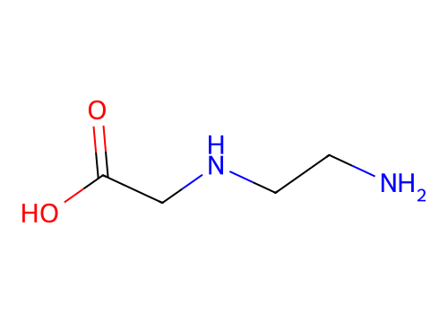

* **Systematic IUPAC Name**: 2-[(2-aminoethyl)amino]acetic acid
* **Canonical SMILES**: `NCCNCC(=O)O`
* **Functional Role & Operational Specification**: Achiral, uncharged pseudopeptide backbone replacing the sugar-phosphodiester scaffold of natural nucleic acids.

### Fmoc-PNA-T-OH (Thymine PNA Monomer)
DST-PNA-002&nbsp;
C₂₆H₂₆N₄O₇ &bull; 506.52 Da&nbsp;

  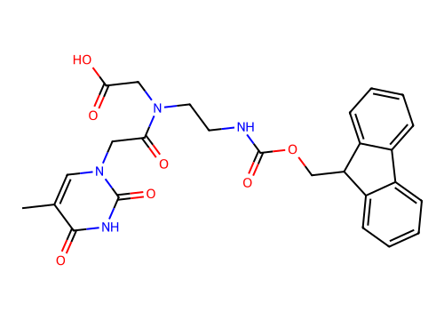

* **Systematic IUPAC Name**: 2-[2-(9H-fluoren-9-ylmethoxycarbonylamino)ethyl-[2-(5-methyl-2,4-dioxopyrimidin-1-yl)acetyl]amino]acetic acid
* **Canonical SMILES**: `Cc1cn(CC(=O)N(CCNC(=O)OCC2c3ccccc3-c3ccccc32)CC(=O)O)c(=O)[nH]c1=O`
* **Functional Role & Operational Specification**: Standard Fmoc-protected thymine monomer for automated SPPS on Intavis MultiPep RSi synthesizer.

### Fmoc-PNA-A(Bhoc)-OH (Adenine PNA Monomer)
DST-PNA-003&nbsp;
C₄₀H₃₅N₇O₇ &bull; 725.76 Da&nbsp;

  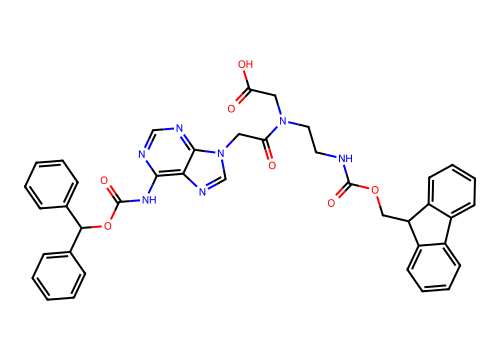

* **Systematic IUPAC Name**: 2-[2-(9H-fluoren-9-ylmethoxycarbonylamino)ethyl-[2-[6-(benzhydryloxycarbonylamino)purin-9-yl]acetyl]amino]acetic acid
* **Canonical SMILES**: `O=C(O)CN(CCNC(=O)OCC1c2ccccc2-c2ccccc21)C(=O)Cn1cnc2c(NC(=O)OC(c3ccccc3)c3ccccc3)ncnc21`
* **Functional Role & Operational Specification**: Standard Fmoc-protected adenine monomer bearing exocyclic N6-Bhoc acid-labile protection.

### Fmoc-PNA-C(Bhoc)-OH (Cytosine PNA Monomer)
DST-PNA-004&nbsp;
C₃₉H₃₅N₅O₈ &bull; 701.74 Da&nbsp;

  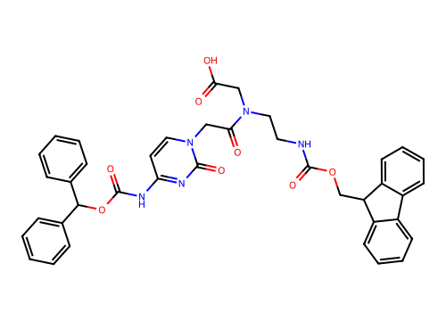

* **Systematic IUPAC Name**: 2-[2-(9H-fluoren-9-ylmethoxycarbonylamino)ethyl-[2-[4-(benzhydryloxycarbonylamino)-2-oxopyrimidin-1-yl]acetyl]amino]acetic acid
* **Canonical SMILES**: `O=C(O)CN(CCNC(=O)OCC1c2ccccc2-c2ccccc21)C(=O)Cn1ccc(NC(=O)OC(c2ccccc2)c2ccccc2)nc1=O`
* **Functional Role & Operational Specification**: Standard Fmoc-protected cytosine monomer with exocyclic N4-Bhoc protecting group.

### Fmoc-PNA-G(Bhoc)-OH (Guanine PNA Monomer)
DST-PNA-005&nbsp;
C₄₀H₃₅N₇O₈ &bull; 741.76 Da&nbsp;

  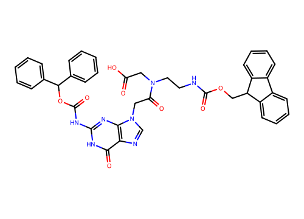

* **Systematic IUPAC Name**: 2-[2-(9H-fluoren-9-ylmethoxycarbonylamino)ethyl-[2-[2-(benzhydryloxycarbonylamino)-6-oxo-1H-purin-9-yl]acetyl]amino]acetic acid
* **Canonical SMILES**: `O=C(O)CN(CCNC(=O)OCC1c2ccccc2-c2ccccc21)C(=O)Cn1cnc2c(=O)[nH]c(NC(=O)OC(c3ccccc3)c3ccccc3)nc21`
* **Functional Role & Operational Specification**: Standard Fmoc-protected guanine monomer featuring N2-Bhoc protection for clean SPPS elongation.

## 2. Chiral γ-L-Glutamyl PNA Monomers

### Fmoc-A(Bhoc)-γ-Glu-OH (Chiral γ-L-Glutamyl PNA Adenine)
DST-GAM-001&nbsp;
C₄₇H₄₇N₇O₉ &bull; 853.93 Da&nbsp;

  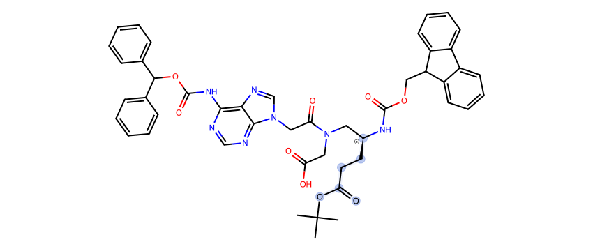

* **Systematic IUPAC Name**: 2-[[2-[6-(benzhydryloxycarbonylamino)purin-9-yl]acetyl]-[(2S)-5-tert-butoxy-2-(9H-fluoren-9-ylmethoxycarbonylamino)-5-oxopentyl]amino]acetic acid
* **Canonical SMILES**: `CC(C)(C)OC(=O)CC[C@@H](CN(CC(=O)O)C(=O)Cn1cnc2c(NC(=O)OC(c3ccccc3)c3ccccc3)ncnc21)NC(=O)OCC1c2ccccc2-c2ccccc21`
* **Functional Role & Operational Specification**: Chiral (S)-γ-modified PNA adenine building block derived from L-glutamic acid. Key component validated in batch DGL-260520-001 (DGL 299-3p_6.0). Induces a stable right-handed duplex conformation with elevated target affinity and improved water solubility.

### Fmoc-Cglu(Bhoc)-OH (Chiral γ-L-Glutamyl PNA Cytosine)
DST-GAM-002&nbsp;
C₄₆H₄₇N₅O₁₀ &bull; 829.91 Da&nbsp;

  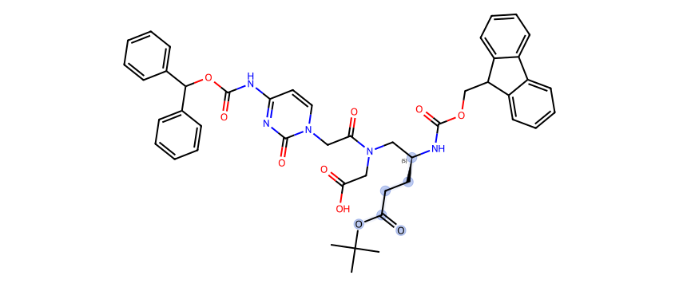

* **Systematic IUPAC Name**: 2-[[2-[4-(benzhydryloxycarbonylamino)-2-oxopyrimidin-1-yl]acetyl]-[(2S)-5-tert-butoxy-2-(9H-fluoren-9-ylmethoxycarbonylamino)-5-oxopentyl]amino]acetic acid
* **Canonical SMILES**: `CC(C)(C)OC(=O)CC[C@@H](CN(CC(=O)O)C(=O)Cn1ccc(NC(=O)OC(c2ccccc2)c2ccccc2)nc1=O)NC(=O)OCC1c2ccccc2-c2ccccc21`
* **Functional Role & Operational Specification**: Chiral (S)-γ-L-glutamyl cytosine PNA monomer with OtBu ester and Bhoc protection. Pre-organizes PNA into a right-handed helix and eliminates sequence-dependent aggregation.

### Fmoc-Gglu(Bhoc)-OH (Chiral γ-L-Glutamyl PNA Guanine)
DST-GAM-003&nbsp;
C₄₇H₄₇N₇O₁₀ &bull; 869.93 Da&nbsp;

  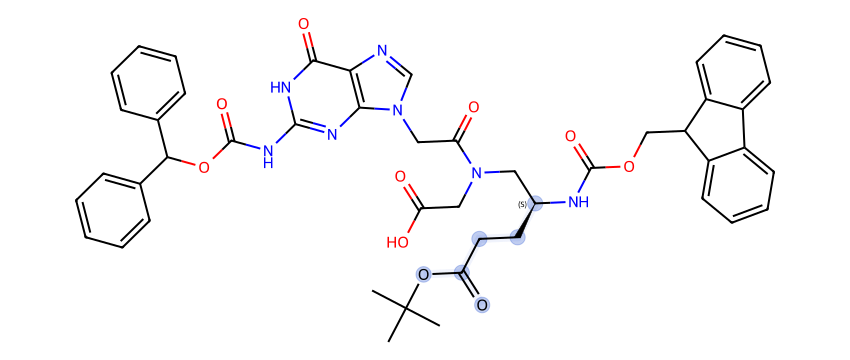

* **Systematic IUPAC Name**: 2-[[2-[2-(benzhydryloxycarbonylamino)-6-oxo-1H-purin-9-yl]acetyl]-[(2S)-5-tert-butoxy-2-(9H-fluoren-9-ylmethoxycarbonylamino)-5-oxopentyl]amino]acetic acid
* **Canonical SMILES**: `CC(C)(C)OC(=O)CC[C@@H](CN(CC(=O)O)C(=O)Cn1cnc2c(=O)[nH]c(NC(=O)OC(c3ccccc3)c3ccccc3)nc21)NC(=O)OCC1c2ccccc2-c2ccccc21`
* **Functional Role & Operational Specification**: Chiral (S)-γ-L-glutamyl guanine PNA monomer. Completes the chiral γ-Glu PNA quartet, preventing G-quadruplex formation while increasing RNA binding affinity.

### Fmoc-T-γ-Glu-OH (Chiral γ-L-Glutamyl PNA Thymine)
DST-GAM-004&nbsp;
C₃₃H₃₈N₄O₉ &bull; 634.69 Da&nbsp;

  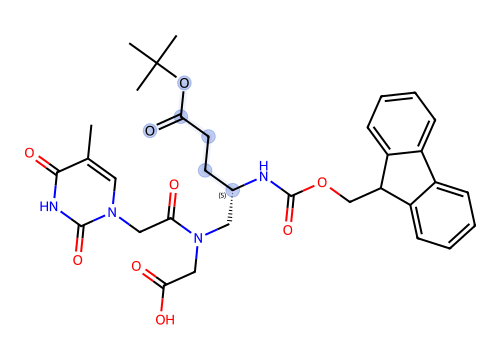

* **Systematic IUPAC Name**: 2-[[(2S)-5-tert-butoxy-2-(9H-fluoren-9-ylmethoxycarbonylamino)-5-oxopentyl]-[2-(5-methyl-2,4-dioxopyrimidin-1-yl)acetyl]amino]acetic acid
* **Canonical SMILES**: `Cc1cn(CC(=O)N(CC(=O)O)C[C@H](CCC(=O)OC(C)(C)C)NC(=O)OCC2c3ccccc3-c3ccccc32)c(=O)[nH]c1=O`
* **Functional Role & Operational Specification**: Chiral (S)-γ-L-glutamyl thymine monomer validated in batch DGL-260520-001. Provides steric pre-organization, ΔTm enhancement, and negative carboxylate charge post-deprotection.

## 3. Abasic DGL Monomers (Dynamic Chemical Labeling)

### Fmoc-*L-Ser*-OH (Chiral Abasic DGL PNA Monomer)
DST-DGL-001&nbsp;
C₂₉H₃₈N₂O₇ &bull; 526.63 Da&nbsp;

  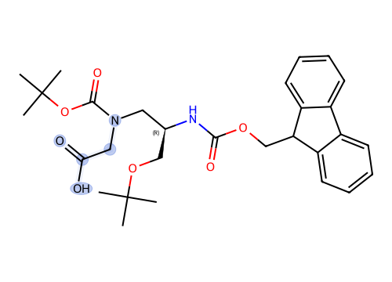

* **Systematic IUPAC Name**: 2-[[(2S)-3-tert-butoxy-2-(9H-fluoren-9-ylmethoxycarbonylamino)propyl]-[(2-methylpropan-2-yl)oxycarbonyl]amino]acetic acid
* **Canonical SMILES**: `CC(C)(C)OC[C@@H](CN(CC(=O)O)C(=O)OC(C)(C)C)NC(=O)OCC1c2ccccc2-c2ccccc21`
* **Functional Role & Operational Specification**: Chiral L-serine-derived abasic building block validated in batch DGL-260520-001. Features a protected (S)-CH2OtBu γ-sidechain and central Boc-protected secondary amine, creating the defined pocket for Dynamic Chemical Labeling (DCL).

### Fmoc-Aeg-OH (Achiral Abasic DGL Monomer)
DST-DGL-002&nbsp;
C₁₉H₂₀N₂O₄ &bull; 340.38 Da&nbsp;

  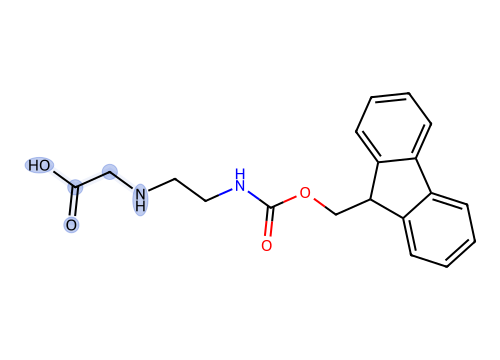

* **Systematic IUPAC Name**: 2-[2-(9H-fluoren-9-ylmethoxycarbonylamino)ethylamino]acetic acid
* **Canonical SMILES**: `O=C(O)CNCCNC(=O)OCC1c2ccccc2-c2ccccc21`
* **Functional Role & Operational Specification**: Achiral abasic monomer generating an unhindered secondary amine pocket within the PNA duplex for Watson-Crick guided dynamic base incorporation (Patent WO2018011320).

## 4. Functionalized SMART Probes (Dynamic Chemical Labeling)

### SMART C REX PEG12-Biotin (Aldehyde Cytosine Probe)
DST-SMART-001&nbsp;
C₄₆H₈₁N₇O₁₇S &bull; 1036.25 Da&nbsp;

  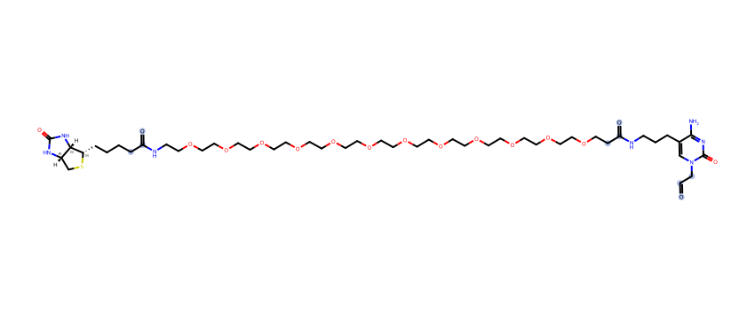

* **Systematic IUPAC Name**: N-[3-[4-amino-2-oxo-1-(2-oxoethyl)pyrimidin-5-yl]propyl]-1-[5-[(3aS,4S,6aR)-2-oxo-1,3,3a,4,6,6a-hexahydrothieno[3,4-d]imidazol-4-yl]pentanoylamino]-3,6,9,12,15,18,21,24,27,30,33,36-dodecaoxanonatriacontan-39-amide
* **Canonical SMILES**: `Nc1nc(=O)n(CC=O)cc1CCCNC(=O)CCOCCOCCOCCOCCOCCOCCOCCOCCOCCOCCOCCOCCNC(=O)CCCC[C@@H]1SC[C@@H]2NC(=O)N[C@@H]21`
* **Functional Role & Operational Specification**: Flagship SMART base reagent for Dynamic Chemical Labeling (DCL). Features an N1-formylmethyl reactive aldehyde head for reversible imine condensation and reductive amination within the abasic DGL pocket, coupled via a monodisperse PEG12 spacer to D-biotin for magnetic bead capture.

## 5. Linkers, Spacers & Solid Supports

### Fmoc-AEEA-OH (Fmoc-EAAE-OH / Mini-PEG-2 Spacer)
DST-SPC-001&nbsp;
C₂₁H₂₃NO₆ &bull; 385.42 Da&nbsp;

  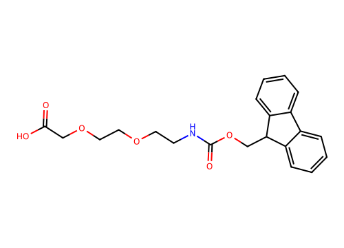

* **Systematic IUPAC Name**: 2-[2-[2-(9H-fluoren-9-ylmethoxycarbonylamino)ethoxy]ethoxy]acetic acid
* **Canonical SMILES**: `O=C(O)COCCOCCNC(=O)OCC1c2ccccc2-c2ccccc21`
* **Functional Role & Operational Specification**: 8-amino-3,6-dioxaoctanoic acid (mini-PEG-2) spacer validated in batch DGL-260520-001 (Monomer Code: X). Separates recognition sequences from solid surfaces, fluorophores, or affinity tags.

### Fmoc-Rink Amide Linker (RAM Linker)
DST-RES-001&nbsp;
C₃₂H₂₉NO₆ &bull; 523.59 Da&nbsp;

  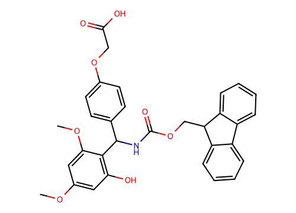

* **Systematic IUPAC Name**: 2-[4-[[4-(9H-fluoren-9-ylmethoxycarbonylamino)-(2,4-dimethoxyphenyl)methyl]phenoxy]]acetic acid
* **Canonical SMILES**: `COc1cc(OC)c(c(O)c1)C(c1ccc(OCC(=O)O)cc1)NC(=O)OCC1c2ccccc2-c2ccccc21`
* **Functional Role & Operational Specification**: Acid-labile anchor on TentaGel S RAM and TentaGel XV resins (0.23 mmol/g loading), releasing C-terminal primary carboxamides (-CONH2) upon TFA cleavage.

## 6. Target RNA Ribomononucleotides

### Adenosine 5'-Monophosphate (AMP / RNA Monomer A)
DST-RNA-001&nbsp;
C₁₀H₁₄N₅O₇P &bull; 347.22 Da&nbsp;

  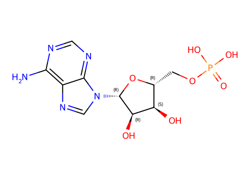

* **Systematic IUPAC Name**: [(2R,3S,4R,5R)-5-(6-aminopurin-9-yl)-3,4-dihydroxyoxolan-2-yl]methyl dihydrogen phosphate
* **Canonical SMILES**: `Nc1ncnc2c1ncn2[C@@H]1O[C@H](COP(=O)(O)O)[C@@H](O)[C@H]1O`
* **Functional Role & Operational Specification**: Target ribonucleotide unit within target viral or microRNA sequences (e.g., miR-122, miR-299-3p).

### Guanosine 5'-Monophosphate (GMP / RNA Monomer G)
DST-RNA-002&nbsp;
C₁₀H₁₄N₅O₈P &bull; 363.22 Da&nbsp;

  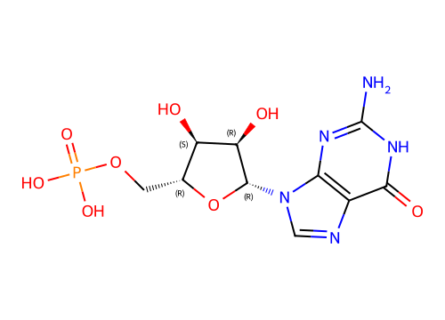

* **Systematic IUPAC Name**: [(2R,3S,4R,5R)-5-(2-amino-6-oxo-1H-purin-9-yl)-3,4-dihydroxyoxolan-2-yl]methyl dihydrogen phosphate
* **Canonical SMILES**: `Nc1nc2c(ncn2[C@@H]2O[C@H](COP(=O)(O)O)[C@@H](O)[C@H]2O)c(=O)[nH]1`
* **Functional Role & Operational Specification**: Target ribonucleotide unit within RNA targets pairing with Destina Cytosine SMART probes.

### Cytidine 5'-Monophosphate (CMP / RNA Monomer C)
DST-RNA-003&nbsp;
C₉H₁₄N₃O₈P &bull; 323.20 Da&nbsp;

  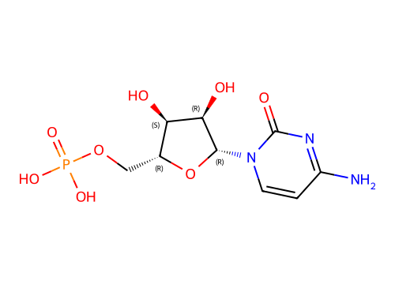

* **Systematic IUPAC Name**: [(2R,3S,4R,5R)-5-(4-amino-2-oxopyrimidin-1-yl)-3,4-dihydroxyoxolan-2-yl]methyl dihydrogen phosphate
* **Canonical SMILES**: `Nc1ccn([C@@H]2O[C@H](COP(=O)(O)O)[C@@H](O)[C@H]2O)c(=O)n1`
* **Functional Role & Operational Specification**: Target ribonucleotide unit pairing with Guanine SMART probes for single-base resolution.

### Uridine 5'-Monophosphate (UMP / RNA Monomer U)
DST-RNA-004&nbsp;
C₉H₁₃N₂O₉P &bull; 324.18 Da&nbsp;

  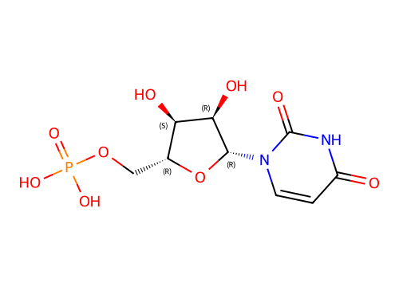

* **Systematic IUPAC Name**: [(2R,3S,4R,5R)-5-(2,4-dioxopyrimidin-1-yl)-3,4-dihydroxyoxolan-2-yl]methyl dihydrogen phosphate
* **Canonical SMILES**: `O=c1ccn([C@@H]2O[C@H](COP(=O)(O)O)[C@@H](O)[C@H]2O)c(=O)[nH]1`
* **Functional Role & Operational Specification**: Target ribonucleotide unit pairing with Adenine SMART probes for single-base discrimination.

## 7. Solid-Phase Coupling, Activation & Capping Reagents

### Oxyma Pure (Coupling Activator)
DST-REA-001&nbsp;
C₅H₆N₂O₃ &bull; 142.11 Da&nbsp;

  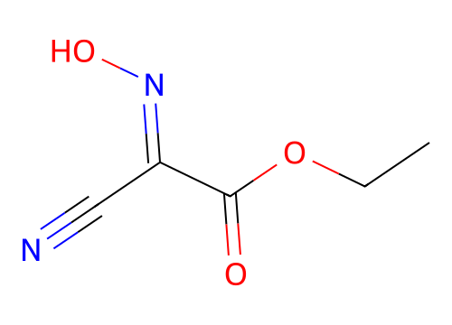

* **Systematic IUPAC Name**: Ethyl 2-cyano-2-hydroxyiminoacetate
* **Canonical SMILES**: `CCOC(=O)C(C#N)=NO`
* **Functional Role & Operational Specification**: Solution 3 (1.0 M in NMP). Non-explosive racemization suppressant forming highly reactive active esters with carboxylic acids.

### DIC (N,N'-Diisopropylcarbodiimide)
DST-REA-002&nbsp;
C₇H₁₄N₂ &bull; 126.20 Da&nbsp;

  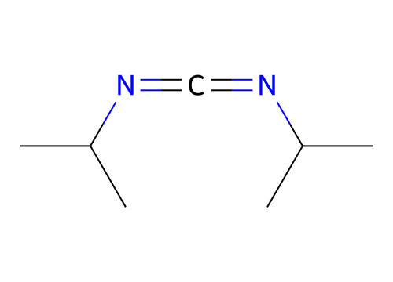

* **Systematic IUPAC Name**: N,N'-diisopropylcarbodiimide
* **Canonical SMILES**: `CC(C)N=C=NC(C)C`
* **Functional Role & Operational Specification**: Solution 4 (1.0 M in NMP). Primary carbodiimide coupling agent generating O-acylisoureas for fast peptide and PNA bond formation.

### Piperidine
DST-REA-003&nbsp;
C₅H₁₁N &bull; 85.15 Da&nbsp;

  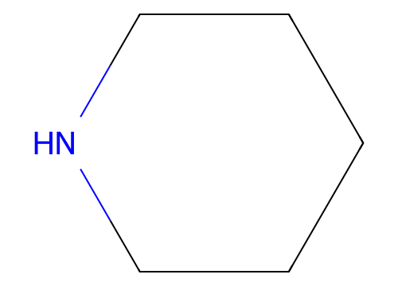

* **Systematic IUPAC Name**: Piperidine (Hexahydropyridine)
* **Canonical SMILES**: `C1CCNCC1`
* **Functional Role & Operational Specification**: Secondary amine base used at 20 % v/v in DMF for cyclic Fmoc deprotection via E1cb proton abstraction.

### 2,6-Lutidine
DST-REA-004&nbsp;
C₇H₉N &bull; 107.16 Da&nbsp;

  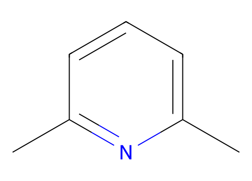

* **Systematic IUPAC Name**: 2,6-dimethylpyridine
* **Canonical SMILES**: `Cc1cccc(C)n1`
* **Functional Role & Operational Specification**: Sterically hindered organic base in Capping mixture (Solution 5, 5 % v/v with Ac2O in DMF) ensuring selective amine neutralization.

### Acetic Anhydride (Ac₂O)
DST-REA-005&nbsp;
C₄H₆O₃ &bull; 102.09 Da&nbsp;

  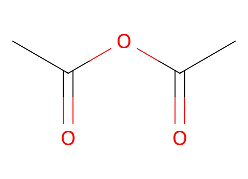

* **Systematic IUPAC Name**: Acetic anhydride
* **Canonical SMILES**: `CC(=O)OC(C)=O`
* **Functional Role & Operational Specification**: Irreversible N-acetylating agent in Capping mixture (Solution 5, 5 % v/v in DMF) terminating unreacted failure sequences.

## 8. Cleavage Cocktails, Scavengers & Peptides

### Trifluoroacetic Acid (TFA)
DST-CLV-001&nbsp;
C₂HF₃O₂ &bull; 114.02 Da&nbsp;

  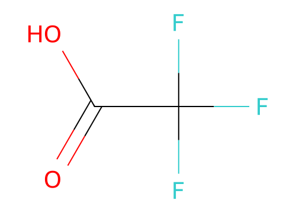

* **Systematic IUPAC Name**: 2,2,2-trifluoroacetic acid
* **Canonical SMILES**: `O=C(O)C(F)(F)F`
* **Functional Role & Operational Specification**: Strong organic acid (92.5 % in Solution 9) cleaving the Rink Amide resin-probe bond and deprotecting Bhoc/Pbf/tBu; also used at 0.1 % v/v as ion-pairing mobile phase modifier in RP-HPLC.

### Triisopropylsilane (TIS)
DST-CLV-002&nbsp;
C₉H₂₂Si &bull; 158.36 Da&nbsp;

  

* **Systematic IUPAC Name**: Tri(propan-2-yl)silane
* **Canonical SMILES**: `CC(C)[SiH](C(C)C)C(C)C`
* **Functional Role & Operational Specification**: High-efficiency carbocation scavenger (5.0 % in Solution 9) quenching reactive tBu+, Bhoc+, and Pbf+ cations.

### Water (Milli-Q Grade)
DST-CLV-003&nbsp;
H₂O &bull; 18.02 Da&nbsp;

  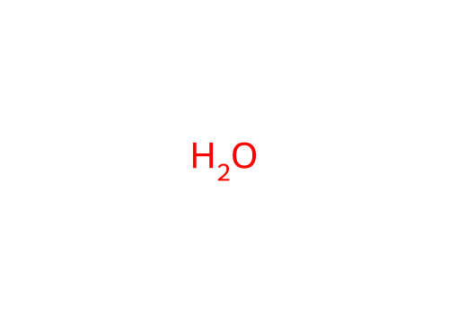

* **Systematic IUPAC Name**: Oxidane
* **Canonical SMILES**: `O`
* **Functional Role & Operational Specification**: Protic co-scavenger in cleavage cocktail (2.5 %), aqueous mobile phase Canal C (Water + 0.1 % TFA), and primary reconstitution solvent.

### Diethyl Ether
DST-CLV-004&nbsp;
C₄H₁₀O &bull; 74.12 Da&nbsp;

  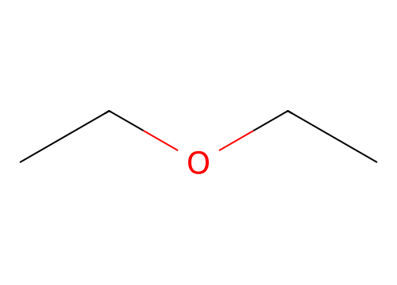

* **Systematic IUPAC Name**: Ethoxyethane
* **Canonical SMILES**: `CCOCC`
* **Functional Role & Operational Specification**: Non-polar precipitation anti-solvent pre-chilled to -20 °C (1.5 mL x 2) for quantitative precipitation and washing of the crude PNA pellet.

### Fmoc-L-Arg(Pbf)-OH (Protected L-Arginine)
DST-PEP-001&nbsp;
C₃₄H₄₀N₄O₇S &bull; 648.78 Da&nbsp;

  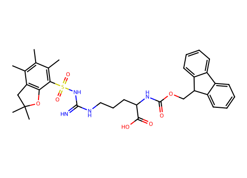

* **Systematic IUPAC Name**: (2S)-2-(9H-fluoren-9-ylmethoxycarbonylamino)-5-[[N-(2,2,4,6,7-pentamethyl-3H-1-benzofuran-5-yl)sulfonylcarbamimidoyl]amino]pentanoic acid
* **Canonical SMILES**: `Cc1c(C)c2c(c(S(=O)(=O)NC(=N)NCCCC(NC(=O)OCC3c4ccccc4-c4ccccc43)C(=O)O)c1C)OC(C)(C)C2`
* **Functional Role & Operational Specification**: Cationic peptide monomer specified in standard cleavage protocols due to the 3-hour acidic exposure requirement for quantitative Pbf deprotection.

## 9. Synthesis & HPLC Grade Process Solvents

### N-Methyl-2-pyrrolidone (NMP)
DST-SOL-001&nbsp;
C₅H₉NO &bull; 99.13 Da&nbsp;

  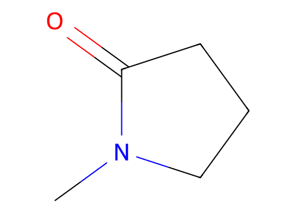

* **Systematic IUPAC Name**: 1-methylpyrrolidin-2-one
* **Canonical SMILES**: `CN1CCCC1=O`
* **Functional Role & Operational Specification**: Peptide synthesis-grade polar aprotic solvent for standard 0.2 M monomer dissolution, Oxyma (Solution 3), and DIC (Solution 4).

### N,N-Dimethylformamide (DMF)
DST-SOL-002&nbsp;
C₃H₇NO &bull; 73.09 Da&nbsp;

  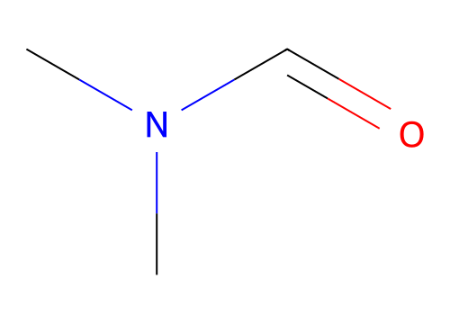

* **Systematic IUPAC Name**: N,N-dimethylformamide
* **Canonical SMILES**: `CN(C)C=O`
* **Functional Role & Operational Specification**: Primary reaction and washing solvent (Solution 6) for resin swelling, cyclic needle decontamination, and deprotection steps.

### Dichloromethane (DCM)
DST-SOL-003&nbsp;
CH₂Cl₂ &bull; 84.93 Da&nbsp;

  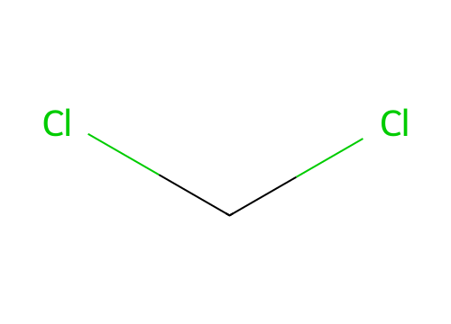

* **Systematic IUPAC Name**: Dichloromethane
* **Canonical SMILES**: `ClCCl`
* **Functional Role & Operational Specification**: Volatile chlorinated solvent (Solution 8) for initial resin pre-swelling (DMF:DCM 2:1) and post-synthesis displacement of DMF.

### Methanol (MeOH)
DST-SOL-004&nbsp;
CH₄O &bull; 32.04 Da&nbsp;

  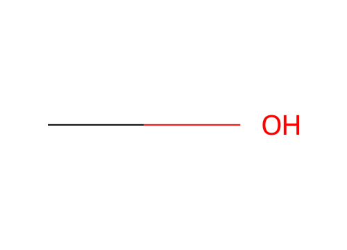

* **Systematic IUPAC Name**: Methanol
* **Canonical SMILES**: `CO`
* **Functional Role & Operational Specification**: HPLC-grade solvent utilized to prepare 1:250 dilutions (Solution 2) for incoming raw material HPLC purity acceptance testing.

### Acetonitrile (ACN)
DST-SOL-005&nbsp;
C₂H₃N &bull; 41.05 Da&nbsp;

  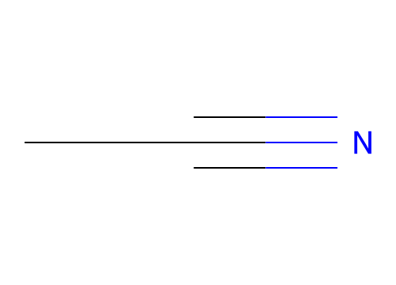

* **Systematic IUPAC Name**: Acetonitrile
* **Canonical SMILES**: `CC#N`
* **Functional Role & Operational Specification**: Organic mobile phase Canal D (ACN + 0.1 % TFA) for reverse-phase analytical and semi-preparative HPLC fractionation on Agilent 1260.

### Dimethyl Sulfoxide (DMSO)
DST-SOL-006&nbsp;
C₂H₆OS &bull; 78.14 Da&nbsp;

  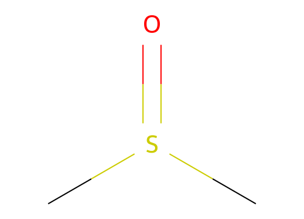

* **Systematic IUPAC Name**: Dimethyl sulfoxide (Methylsulfinylmethane)
* **Canonical SMILES**: `CS(C)=O`
* **Functional Role & Operational Specification**: High-dielectric organic co-solvent (<= 20 % v/v) employed to disperse aggregates and resolve persistent turbidity in hydrophobic probes.

## 10. Analytical Standards, Reporters & Byproducts

### Sinapic Acid (Sinapinic Acid)
DST-MS-001&nbsp;
C₁₁H₁₂O₅ &bull; 224.21 Da&nbsp;

  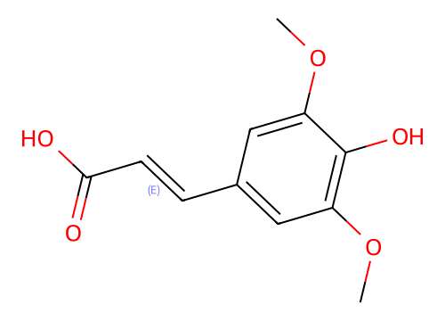

* **Systematic IUPAC Name**: (2E)-3-(4-hydroxy-3,5-dimethoxyphenyl)prop-2-enoic acid
* **Canonical SMILES**: `COc1cc(/C=C/C(=O)O)cc(OC)c1O`
* **Functional Role & Operational Specification**: Soft-ionization MALDI-ToF matrix (10-15 mg/mL in H2O/ACN 1:1 + 0.1 % TFA, Solution 10) optimized for mid-to-high MW PNA/DGL identification on Bruker Autoflex.

### FITC (Fluorescein 5-Isothiocyanate)
DST-FL-001&nbsp;
C₂₁H₁₁NO₅S &bull; 389.39 Da&nbsp;

  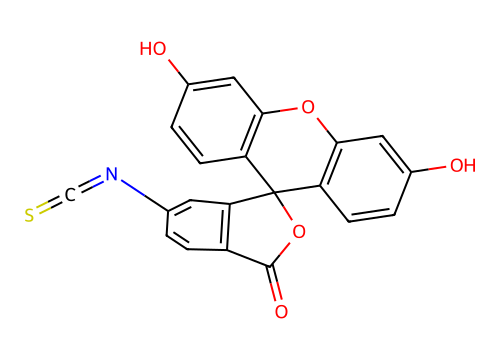

* **Systematic IUPAC Name**: 2-(6-hydroxy-3-oxo-3H-xanthen-9-yl)-5-isothiocyanatobenzoic acid
* **Canonical SMILES**: `O=C1OC2(c3ccc(O)cc3Oc3cc(O)ccc32)c2cc(N=C=S)ccc21`
* **Functional Role & Operational Specification**: Green fluorophore (Ex: 494 nm, Em: 518 nm) used for N-terminal covalent conjugation to PNA/DGL diagnostic probes.

### Rhodamine B
DST-FL-002&nbsp;
C₂₈H₃₀N₂O₃ &bull; 442.56 Da&nbsp;

  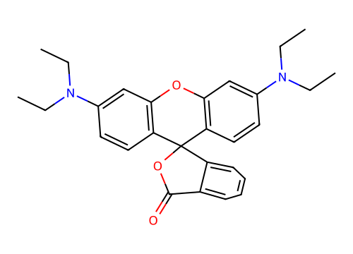

* **Systematic IUPAC Name**: [9-(2-carboxyphenyl)-6-(diethylamino)xanthen-3-ylidene]-diethylazanium
* **Canonical SMILES**: `CCN(CC)c1ccc2c(c1)Oc1cc(N(CC)CC)ccc1C21OC(=O)c2ccccc21`
* **Functional Role & Operational Specification**: Red/pink fluorophore used as fluorescent tracer and for immediate optical inspection of the precipitated pellet.

### Dibenzofulvene (DBF)
DST-BYP-001&nbsp;
C₁₄H₁₀ &bull; 178.23 Da&nbsp;

  

* **Systematic IUPAC Name**: 9-methylidene-9H-fluorene
* **Canonical SMILES**: `C=C1c2ccccc2-c2ccccc21`
* **Functional Role & Operational Specification**: Electrophilic fulvene intermediate generated during Fmoc cleavage, trapped by piperidine to form DBF-piperidine adducts quantified at 301 nm.

### Adenine (A)
DST-BAS-001&nbsp;
C₅H₅N₅ &bull; 135.13 Da&nbsp;

  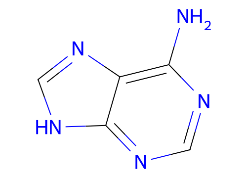

* **Systematic IUPAC Name**: 7H-purin-6-amine
* **Canonical SMILES**: `Nc1ncnc2[nH]cnc12`
* **Functional Role & Operational Specification**: Free nucleobase reference for probe spectrophotometric quantification. Molar extinction coefficient: ε₂₆₀ = 13.7 × 10³ M⁻¹ cm⁻¹.

### Cytosine (C)
DST-BAS-002&nbsp;
C₄H₅N₃O &bull; 111.10 Da&nbsp;

  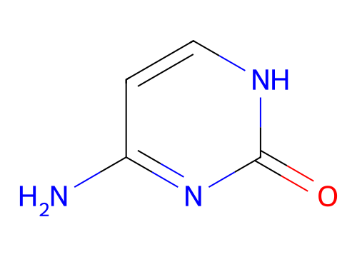

* **Systematic IUPAC Name**: 4-aminopyrimidin-2(1H)-one
* **Canonical SMILES**: `Nc1cc[nH]c(=O)n1`
* **Functional Role & Operational Specification**: Free nucleobase reference for probe spectrophotometric quantification. Molar extinction coefficient: ε₂₆₀ = 6.6 × 10³ M⁻¹ cm⁻¹.

### Guanine (G)
DST-BAS-003&nbsp;
C₅H₅N₅O &bull; 151.13 Da&nbsp;

  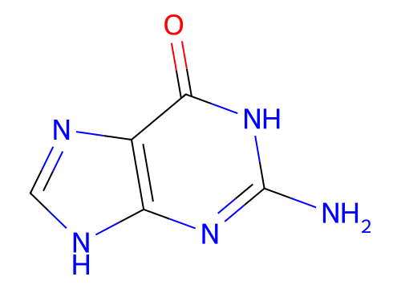

* **Systematic IUPAC Name**: 2-amino-1,9-dihydro-6H-purin-6-one
* **Canonical SMILES**: `Nc1nc2[nH]cnc2c(=O)[nH]1`
* **Functional Role & Operational Specification**: Free nucleobase reference for probe spectrophotometric quantification. Molar extinction coefficient: ε₂₆₀ = 11.7 × 10³ M⁻¹ cm⁻¹.

### Thymine (T)
DST-BAS-004&nbsp;
C₅H₆N₂O₂ &bull; 126.11 Da&nbsp;

  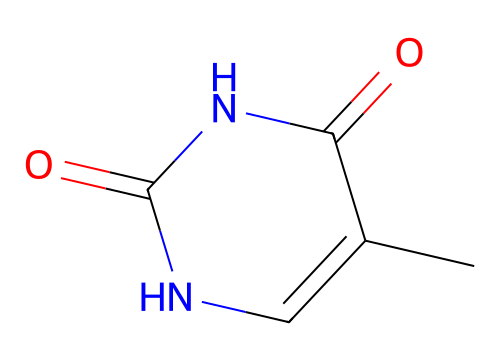

* **Systematic IUPAC Name**: 5-methylpyrimidine-2,4(1H,3H)-dione
* **Canonical SMILES**: `Cc1c[nH]c(=O)[nH]c1=O`
* **Functional Role & Operational Specification**: Free nucleobase reference for probe spectrophotometric quantification. Molar extinction coefficient: ε₂₆₀ = 8.8 × 10³ M⁻¹ cm⁻¹.

## 6. SMART Probe Synthetic Intermediates & Reagents (PT-SQ-001)

### 5-Iodocytosine (4-Amino-5-iodopyrimidin-2(1H)-one)
DST-SMT-001&nbsp;
C₄H₄IN₃O &bull; 237.00 Da&nbsp;
CAS: 1122-44-7

  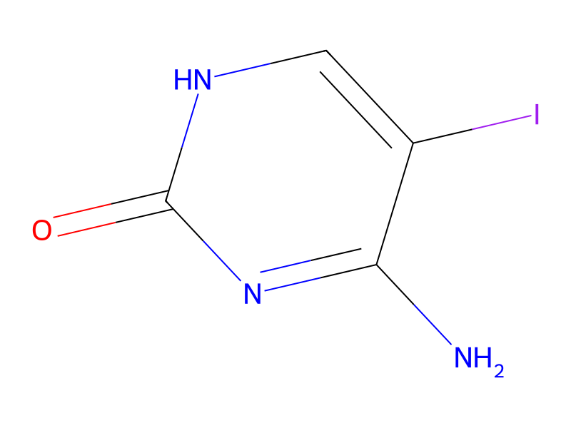

* **Systematic IUPAC Name**: 4-amino-5-iodopyrimidin-2(1H)-one
* **Canonical SMILES**: `Nc1nc(=O)[nH]cc1I`
* **Functional Role & Operational Specification**: Starting pyrimidinone substrate (>98% purity) for N1-alkylation in Step 1 of SMART Cytosine synthesis.
* **Reference Document & Synthesis Step**: PT-SQ-001 Paso 1 (Table 2)

### Bromoacetaldehyde Diethyl Acetal (2-Bromo-1,1-diethoxyethane)
DST-SMT-002&nbsp;
C₆H₁₃BrO₂ &bull; 197.07 Da&nbsp;
CAS: 2032-35-1

  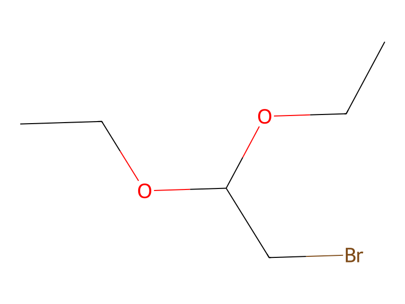

* **Systematic IUPAC Name**: 2-bromo-1,1-diethoxyethane
* **Canonical SMILES**: `CCOC(CBr)OCC`
* **Functional Role & Operational Specification**: Alkylating reagent introducing the protected diethyl acetal mask onto cytosine N1 in Step 1.
* **Reference Document & Synthesis Step**: PT-SQ-001 Paso 1 (Table 2)

### 5-Iodo-Cytosine Acetal (Compound 1)
DST-SMT-003&nbsp;
C₁₀H₁₆IN₃O₃ &bull; 353.16 Da&nbsp;

  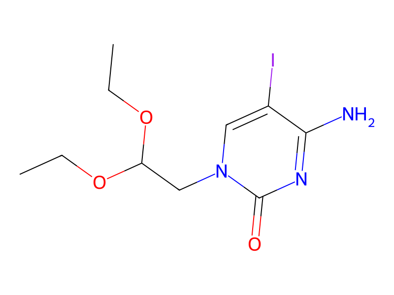

* **Systematic IUPAC Name**: 4-amino-1-(2,2-diethoxyethyl)-5-iodopyrimidin-2(1H)-one
* **Canonical SMILES**: `CCOC(CN1C=C(I)C(N)=NC1=O)OCC`
* **Functional Role & Operational Specification**: Key N1-alkylated acetal intermediate (MW 353.16 Da) for Sonogashira cross-coupling in Step 2.
* **Reference Document & Synthesis Step**: PT-SQ-001 Paso 1 & Paso 2 (Table 3)

### N-Propargyltrifluoroacetamide (2,2,2-Trifluoro-N-(prop-2-yn-1-yl)acetamide)
DST-SMT-004&nbsp;
C₅H₄F₃NO &bull; 151.09 Da&nbsp;
CAS: 14719-21-2

  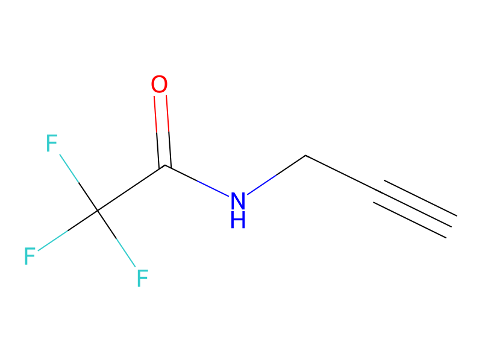

* **Systematic IUPAC Name**: 2,2,2-trifluoro-N-(prop-2-yn-1-yl)acetamide
* **Canonical SMILES**: `O=C(NCC#C)C(F)(F)F`
* **Functional Role & Operational Specification**: Terminal alkyne partner for Sonogashira cross-coupling with 5-iodocytosine acetal in Step 2.
* **Reference Document & Synthesis Step**: PT-SQ-001 Paso 2 (Table 3)

### 5-PropargylamideTfa-Cytosine Acetal (Compound 2)
DST-SMT-005&nbsp;
C₁₅H₁₉F₃N₄O₄ &bull; 376.34 Da&nbsp;

  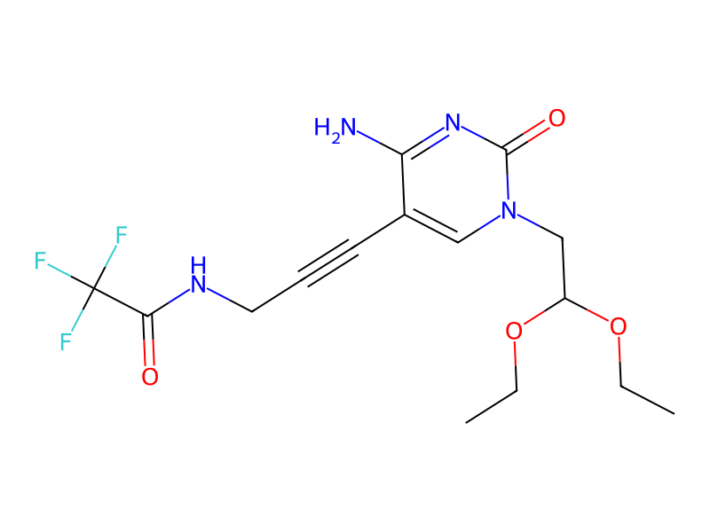

* **Systematic IUPAC Name**: N-(3-(4-amino-1-(2,2-diethoxyethyl)-2-oxo-1,2-dihydropyrimidin-5-yl)prop-2-yn-1-yl)-2,2,2-trifluoroacetamide
* **Canonical SMILES**: `CCOC(CN1C=C(C#CCNC(=O)C(F)(F)F)C(N)=NC1=O)OCC`
* **Functional Role & Operational Specification**: Sonogashira coupling product (MW 376.34 Da) bearing an internal alkyne linker (Step 2 product).
* **Reference Document & Synthesis Step**: PT-SQ-001 Paso 2 & Paso 3 (Table 4)

### 5-PropylamideTfa-Cytosine Acetal / C-REX-NHTfa (Compound 3)
DST-SMT-006&nbsp;
C₁₅H₂₃F₃N₄O₄ &bull; 380.37 Da&nbsp;

  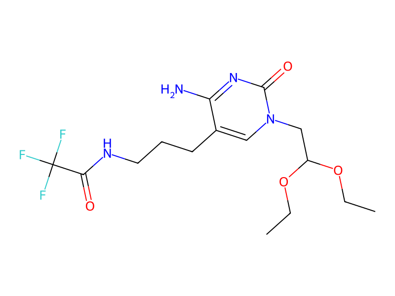

* **Systematic IUPAC Name**: N-(3-(4-amino-1-(2,2-diethoxyethyl)-2-oxo-1,2-dihydropyrimidin-5-yl)propyl)-2,2,2-trifluoroacetamide
* **Canonical SMILES**: `CCOC(CN1C=C(CCCNC(=O)C(F)(F)F)C(N)=NC1=O)OCC`
* **Functional Role & Operational Specification**: Hydrogenated flexible C5-propyl linker intermediate (MW 380.37 Da) prepared by Pd/C catalysis (Step 3).
* **Reference Document & Synthesis Step**: PT-SQ-001 Paso 3 & Paso 4 (Table 5)

### AC-REX-NH2 (Compound 4 / Cytosine REX NH2 Acetal)
DST-SMT-007&nbsp;
C₁₃H₂₄N₄O₃ &bull; 284.36 Da&nbsp;

  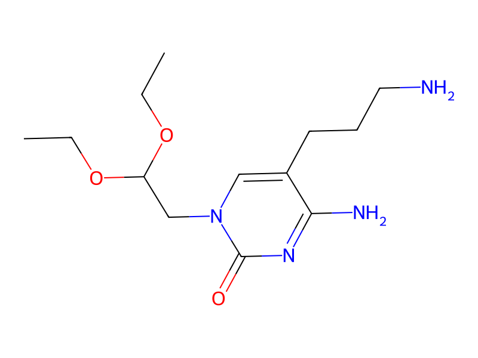

* **Systematic IUPAC Name**: 4-amino-5-(3-aminopropyl)-1-(2,2-diethoxyethyl)pyrimidin-2(1H)-one
* **Canonical SMILES**: `CCOC(CN1C=C(CCCN)C(N)=NC1=O)OCC`
* **Functional Role & Operational Specification**: Key deprotected nucleophilic primary amine (MW 284.36 Da) used as master platform for all SMART Cytosine labeling (Step 4).
* **Reference Document & Synthesis Step**: PT-SQ-001 Paso 4 & Paso 5 (Table 6)

### NHS-PEG12-Biotin (Biotin-dPEG12-NHS Ester)
DST-SMT-008&nbsp;
C₄₁H₇₂N₄O₁₈S &bull; 941.10 Da&nbsp;
CAS: 365441-71-0

  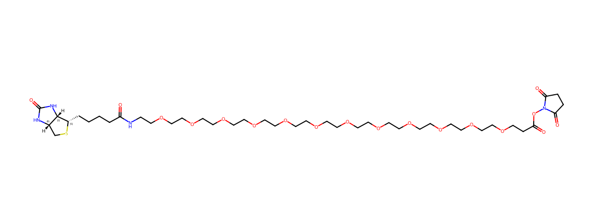

* **Systematic IUPAC Name**: 2,5-dioxopyrrolidin-1-yl 1-(5-((3aS,4S,6aR)-2-oxohexahydro-1H-thieno[3,4-d]imidazol-4-yl)pentanamido)-3,6,9,12,15,18,21,24,27,30,33,36-dodecaoxanonatriacontan-39-oate
* **Canonical SMILES**: `O=C(ON1C(=O)CCC1=O)CCOCCOCCOCCOCCOCCOCCOCCOCCOCCOCCOCCOCCNC(=O)CCCC[C@@H]2SC[C@@H]3NC(=O)N[C@H]23`
* **Functional Role & Operational Specification**: Monodisperse discrete PEG12 biotin active ester (MW 941.09 Da) for quantitative labeling of AC-REX-NH2 in Step 5.
* **Reference Document & Synthesis Step**: PT-SQ-001 Paso 5 (Table 6)

### AC-RP12-B (Compound 5 / Acetal Cytosine-REX-PEG12-Biotin)
DST-SMT-009&nbsp;
C₅₀H₉₁N₇O₁₈S &bull; 1110.38 Da&nbsp;

  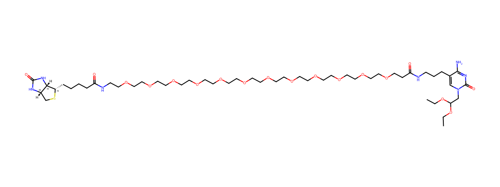

* **Systematic IUPAC Name**: N-(3-(4-amino-1-(2,2-diethoxyethyl)-2-oxo-1,2-dihydropyrimidin-5-yl)propyl)-1-(5-((3aS,4S,6aR)-2-oxohexahydro-1H-thieno[3,4-d]imidazol-4-yl)pentanamido)-3,6,9,12,15,18,21,24,27,30,33,36-dodecaoxanonatriacontan-39-amide
* **Canonical SMILES**: `CCOC(CN1C=C(CCCNC(=O)CCOCCOCCOCCOCCOCCOCCOCCOCCOCCOCCOCCOCCNC(=O)CCCC[C@@H]2SC[C@@H]3NC(=O)N[C@H]23)C(N)=NC1=O)OCC`
* **Functional Role & Operational Specification**: Full conjugate acetal intermediate (MW 1110.37 Da) prior to final aqueous TFA deprotection to generate the active aldehyde (Step 5).
* **Reference Document & Synthesis Step**: PT-SQ-001 Paso 5 & Paso 6 (Table 7)

## 7. γ-Chiral Glutamic PNA Platform (PS_Gamma Glu & SOP_EE)

### Fmoc-L-Glu(OtBu)-ol
DST-GLU-001&nbsp;
C₂₄H₂₉NO₅ &bull; 411.50 Da&nbsp;
CAS: 153815-59-9

  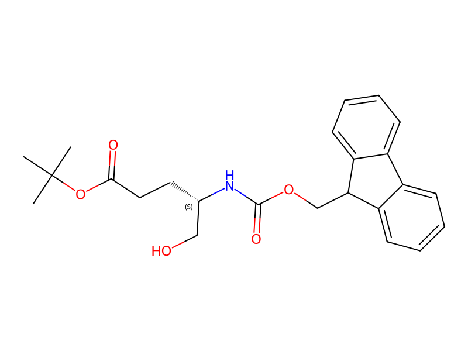

* **Systematic IUPAC Name**: (S)-tert-butyl 4-((((9H-fluoren-9-yl)methoxy)carbonyl)amino)-5-hydroxypentanoate
* **Canonical SMILES**: `CC(C)(C)OC(=O)CC[C@@H](CO)NC(=O)OCC1c2ccccc2-c3ccccc31`
* **Functional Role & Operational Specification**: Commercial enantiopure L-amino alcohol starting material for chiral γ-L-Glu PNA backbone synthesis.
* **Reference Document & Synthesis Step**: PS_Gamma Glu Monomers Step 1

### DGSL-Fmoc-L-Glu(OtBu)-H
DST-GLU-002&nbsp;
C₂₄H₂₇NO₅ &bull; 409.48 Da&nbsp;

  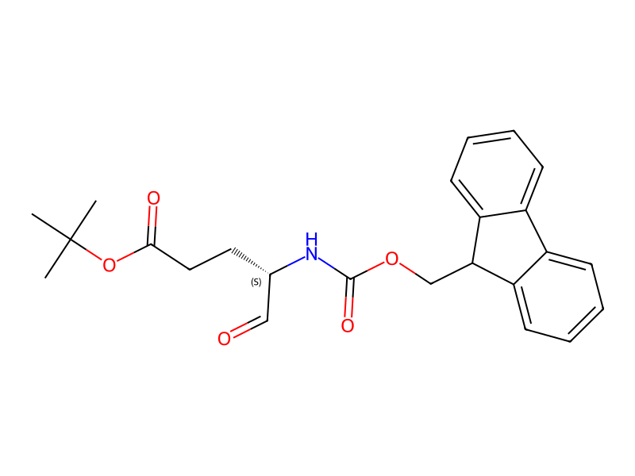

* **Systematic IUPAC Name**: (S)-tert-butyl 4-((((9H-fluoren-9-yl)methoxy)carbonyl)amino)-5-oxopentanoate
* **Canonical SMILES**: `CC(C)(C)OC(=O)CC[C@@H](C=O)NC(=O)OCC1c2ccccc2-c3ccccc31`
* **Functional Role & Operational Specification**: Chiral α-amino aldehyde generated via Dess-Martin oxidation maintaining 100% enantiomeric excess (Step 1).
* **Reference Document & Synthesis Step**: PS_Gamma Glu Monomers Step 1 & SOP_EE

### γ-L-Glutamic Backbone (DGSL-g-Glu-PNA-COOMe)
DST-GLU-003&nbsp;
C₂₇H₃₄N₂O₆ &bull; 482.58 Da&nbsp;

  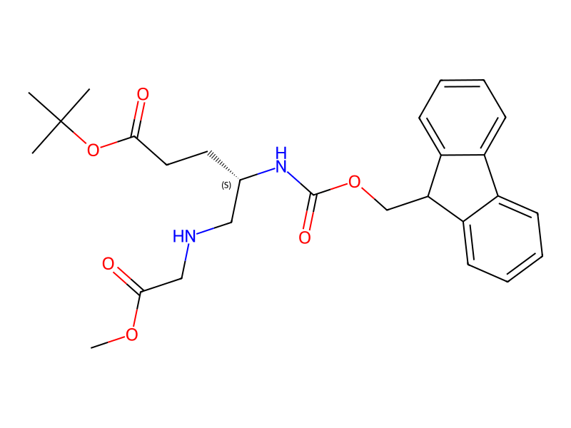

* **Systematic IUPAC Name**: methyl N-((S)-2-((((9H-fluoren-9-yl)methoxy)carbonyl)amino)-4-(tert-butoxycarbonyl)butyl)glycinate
* **Canonical SMILES**: `CC(C)(C)OC(=O)CC[C@@H](CNCC(=O)OC)NC(=O)OCC1c2ccccc2-c3ccccc31`
* **Functional Role & Operational Specification**: Chiral (S)-L-glutamic pseudopeptide backbone (ee = 100%, Tr = 25.728 min on Cellulose-1 chiral HPLC) (Step 2).
* **Reference Document & Synthesis Step**: PS_Gamma Glu Monomers Step 2 & SOP_EE

### γ-D-Glutamic Backbone (DGSL-g-D-Glu-PNA-COOMe)
DST-GLU-004&nbsp;
C₂₇H₃₄N₂O₆ &bull; 482.58 Da&nbsp;

  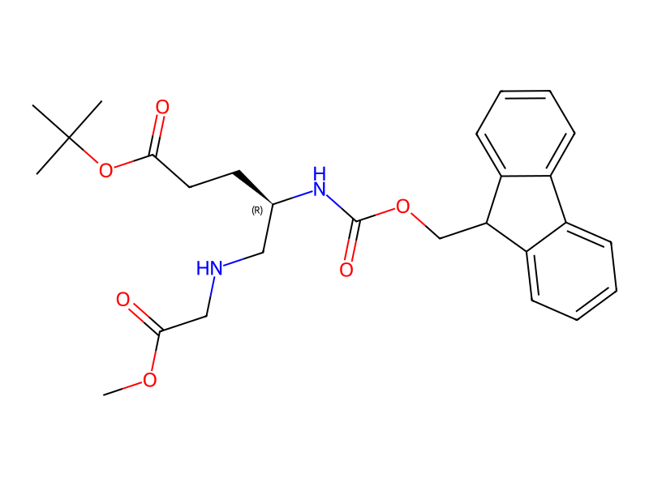

* **Systematic IUPAC Name**: methyl N-((R)-2-((((9H-fluoren-9-yl)methoxy)carbonyl)amino)-4-(tert-butoxycarbonyl)butyl)glycinate
* **Canonical SMILES**: `CC(C)(C)OC(=O)CC[C@H](CNCC(=O)OC)NC(=O)OCC1c2ccccc2-c3ccccc31`
* **Functional Role & Operational Specification**: Chiral (R)-D-glutamic backbone synthesized as reference for chiral HPLC validation (ee = 100%, Tr = 48.501 min on Cellulose-1).
* **Reference Document & Synthesis Step**: SOP_EE-GAMMA-GLU-MONOMERS

### DGSL-Boc-γ-Glu-PNA-COOMe
DST-GLU-005&nbsp;
C₃₂H₄₂N₂O₈ &bull; 582.69 Da&nbsp;

  

* **Systematic IUPAC Name**: methyl N-((S)-2-((((9H-fluoren-9-yl)methoxy)carbonyl)amino)-4-(tert-butoxycarbonyl)butyl)-N-(tert-butoxycarbonyl)glycinate
* **Canonical SMILES**: `CC(C)(C)OC(=O)CC[C@@H](CN(CC(=O)OC)C(=O)OC(C)(C)C)NC(=O)OCC1c2ccccc2-c3ccccc31`
* **Functional Role & Operational Specification**: Boc-protected methyl ester intermediate towards *GL* abasic blank monomer (Step 5).
* **Reference Document & Synthesis Step**: PS_Gamma Glu Monomers Step 5

### Blank Monomer - *GL* (Boc-γ-L-Glu-PNA-COOH)
DST-GLU-006&nbsp;
C₃₁H₄₀N₂O₈ &bull; 568.67 Da&nbsp;

  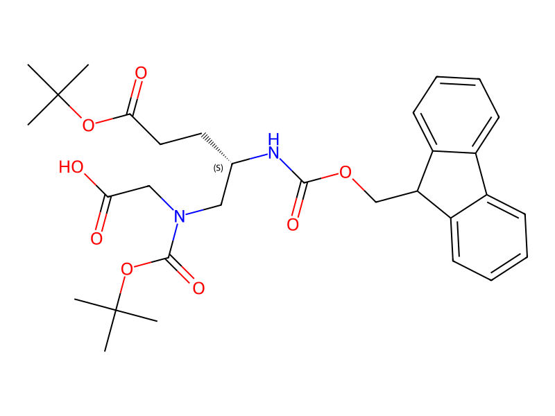

* **Systematic IUPAC Name**: N-((S)-2-((((9H-fluoren-9-yl)methoxy)carbonyl)amino)-4-(tert-butoxycarbonyl)butyl)-N-(tert-butoxycarbonyl)glycine
* **Canonical SMILES**: `CC(C)(C)OC(=O)CC[C@@H](CN(CC(=O)O)C(=O)OC(C)(C)C)NC(=O)OCC1c2ccccc2-c3ccccc31`
* **Functional Role & Operational Specification**: Chiral abasic PNA monomer with glutamic acid sidechain (ee = 100%, Tr = 14.929 min on Cellulose-1, RP-HPLC CBU-2 Tr = 6.504 min) (Step 6).
* **Reference Document & Synthesis Step**: PS_Gamma Glu Monomers Step 6 & SOP_EE

### DhBtOH (3,4-Dihydro-3-hydroxy-4-oxo-1,2,3-benzotriazine)
DST-GLU-007&nbsp;
C₇H₅N₃O₂ &bull; 163.14 Da&nbsp;
CAS: 28230-32-2

  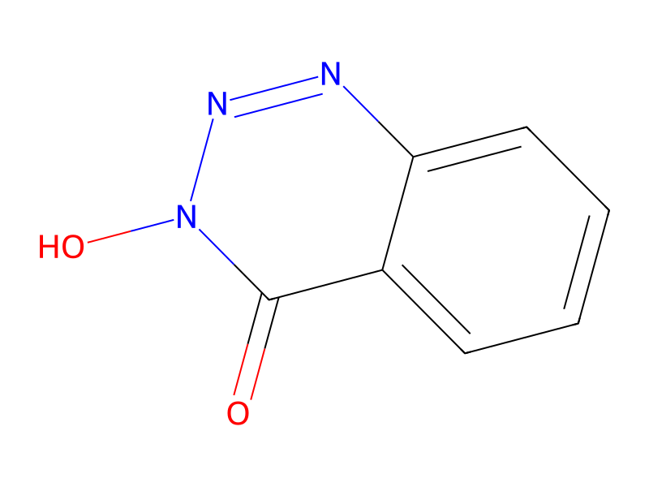

* **Systematic IUPAC Name**: 3-hydroxybenzo[d][1,2,3]triazin-4(3H)-one
* **Canonical SMILES**: `O=C1c2ccccc2N=NN1O`
* **Functional Role & Operational Specification**: Specialized racemization-suppressing coupling additive used in Step 3 for coupling nucleobase acetic acids to the γ-Glu backbone.
* **Reference Document & Synthesis Step**: PS_Gamma Glu Monomers Step 3

### DCC (N,N'-Dicyclohexylcarbodiimide)
DST-GLU-008&nbsp;
C₁₃H₂₂N₂ &bull; 206.33 Da&nbsp;
CAS: 538-75-0

  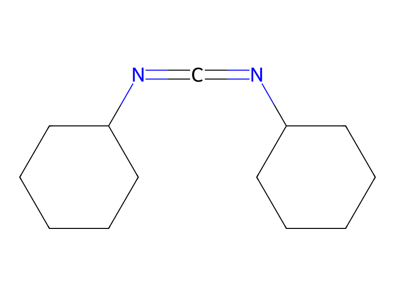

* **Systematic IUPAC Name**: 1,3-dicyclohexylcarbodiimide
* **Canonical SMILES**: `C1CCC(N=C=NC2CCCCC2)CC1`
* **Functional Role & Operational Specification**: Carbodiimide coupling agent paired with DhBtOH for solution-phase synthesis of DGSL-NB-γ-Glu-PNA-COOMe monomers (Step 3).
* **Reference Document & Synthesis Step**: PS_Gamma Glu Monomers Step 3

## 8. γ-Chiral Serine PNA Platform (PS_Gamma Ser)

### Fmoc-L-Ser(tBu)-OH (Starting Material 1a)
DST-SER-001&nbsp;
C₂₂H₂₅NO₅ &bull; 383.44 Da&nbsp;
CAS: 71989-33-8

  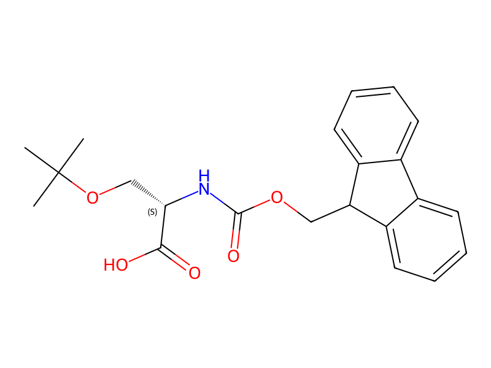

* **Systematic IUPAC Name**: (S)-2-((((9H-fluoren-9-yl)methoxy)carbonyl)amino)-3-(tert-butoxy)propanoic acid
* **Canonical SMILES**: `CC(C)(C)OC[C@@H](C(=O)O)NC(=O)OCC1c2ccccc2-c3ccccc31`
* **Functional Role & Operational Specification**: Enantiopure L-serine starting material for synthesis of chiral γ-L-Serine backbone (Step 1).
* **Reference Document & Synthesis Step**: PS_Gamma Ser Monomers Step 1

### Fmoc-D-Ser(tBu)-OH (Starting Material 1b)
DST-SER-002&nbsp;
C₂₂H₂₅NO₅ &bull; 383.44 Da&nbsp;
CAS: 128107-51-9

  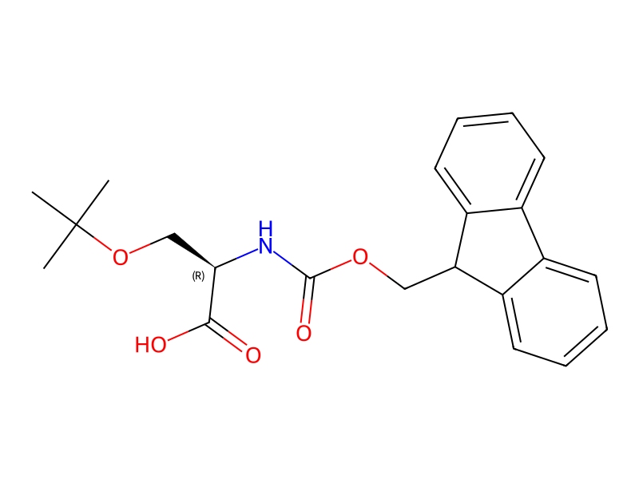

* **Systematic IUPAC Name**: (R)-2-((((9H-fluoren-9-yl)methoxy)carbonyl)amino)-3-(tert-butoxy)propanoic acid
* **Canonical SMILES**: `CC(C)(C)OC[C@H](C(=O)O)NC(=O)OCC1c2ccccc2-c3ccccc31`
* **Functional Role & Operational Specification**: Enantiopure D-serine starting material for synthesis of chiral γ-D-Serine backbone (Step 1).
* **Reference Document & Synthesis Step**: PS_Gamma Ser Monomers Step 1

### Fmoc-L-Ser(tBu)-ol (Alcohol 2a)
DST-SER-003&nbsp;
C₂₂H₂₇NO₄ &bull; 369.46 Da&nbsp;

  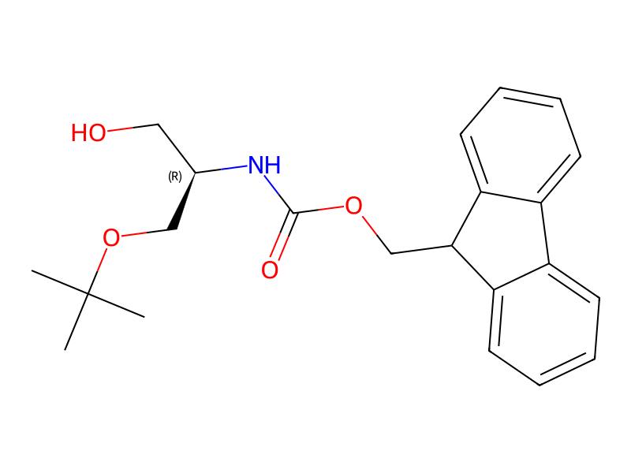

* **Systematic IUPAC Name**: (S)-(9H-fluoren-9-yl)methyl (1-(tert-butoxy)-3-hydroxypropan-2-yl)carbamate
* **Canonical SMILES**: `CC(C)(C)OC[C@@H](CO)NC(=O)OCC1c2ccccc2-c3ccccc31`
* **Functional Role & Operational Specification**: Reduced alcohol intermediate prepared via mixed carbonic anhydride reduction with NaBH4 (Step 1).
* **Reference Document & Synthesis Step**: PS_Gamma Ser Monomers Step 1

### Fmoc-D-Ser(tBu)-ol (Alcohol 2b)
DST-SER-004&nbsp;
C₂₂H₂₇NO₄ &bull; 369.46 Da&nbsp;

  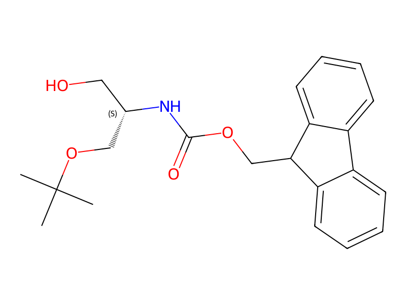

* **Systematic IUPAC Name**: (R)-(9H-fluoren-9-yl)methyl (1-(tert-butoxy)-3-hydroxypropan-2-yl)carbamate
* **Canonical SMILES**: `CC(C)(C)OC[C@H](CO)NC(=O)OCC1c2ccccc2-c3ccccc31`
* **Functional Role & Operational Specification**: D-enantiomeric alcohol intermediate from reduction of Fmoc-D-Ser(tBu)-OH (Step 1).
* **Reference Document & Synthesis Step**: PS_Gamma Ser Monomers Step 1

### Fmoc-L-Ser(tBu)-H (Aldehyde 3a)
DST-SER-005&nbsp;
C₂₂H₂₅NO₄ &bull; 367.45 Da&nbsp;

  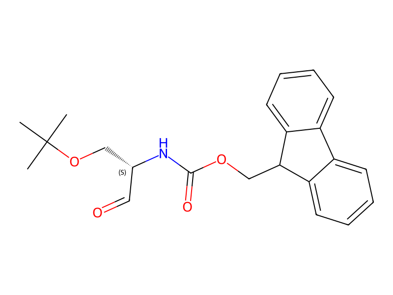

* **Systematic IUPAC Name**: (S)-(9H-fluoren-9-yl)methyl (1-(tert-butoxy)-3-oxopropan-2-yl)carbamate
* **Canonical SMILES**: `CC(C)(C)OC[C@@H](C=O)NC(=O)OCC1c2ccccc2-c3ccccc31`
* **Functional Role & Operational Specification**: Chiral (S)-aldehyde obtained by Dess-Martin oxidation in wet DCM under nitrogen (Step 2).
* **Reference Document & Synthesis Step**: PS_Gamma Ser Monomers Step 2

### Fmoc-D-Ser(tBu)-H (Aldehyde 3b)
DST-SER-006&nbsp;
C₂₂H₂₅NO₄ &bull; 367.45 Da&nbsp;

  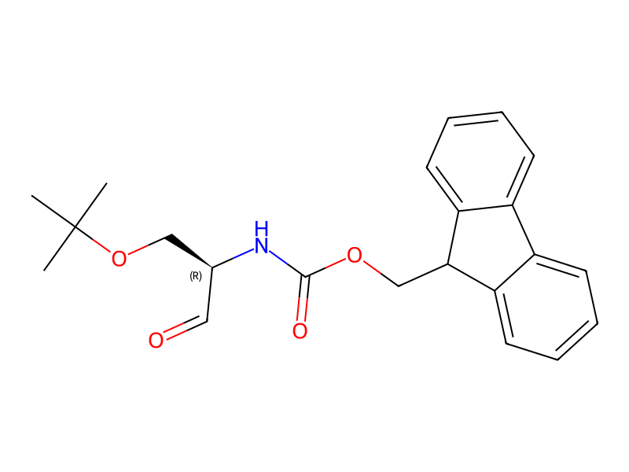

* **Systematic IUPAC Name**: (R)-(9H-fluoren-9-yl)methyl (1-(tert-butoxy)-3-oxopropan-2-yl)carbamate
* **Canonical SMILES**: `CC(C)(C)OC[C@H](C=O)NC(=O)OCC1c2ccccc2-c3ccccc31`
* **Functional Role & Operational Specification**: Chiral (R)-aldehyde intermediate from DMP oxidation (Step 2).
* **Reference Document & Synthesis Step**: PS_Gamma Ser Monomers Step 2

### L-γ-Serine Backbone (Compound 4a)
DST-SER-007&nbsp;
C₂₅H₃₂N₂O₅ &bull; 440.54 Da&nbsp;

  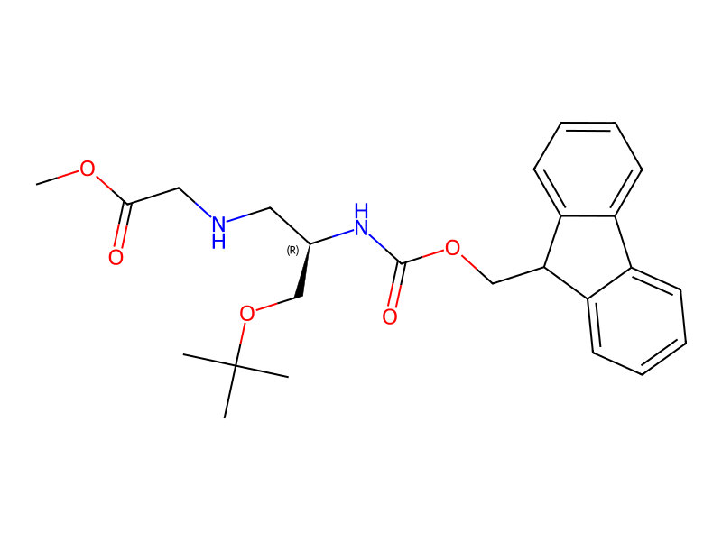

* **Systematic IUPAC Name**: methyl N-((S)-2-((((9H-fluoren-9-yl)methoxy)carbonyl)amino)-3-(tert-butoxy)propyl)glycinate
* **Canonical SMILES**: `CC(C)(C)OC[C@@H](CNCC(=O)OC)NC(=O)OCC1c2ccccc2-c3ccccc31`
* **Functional Role & Operational Specification**: Chiral L-serine pseudopeptide backbone (MW 440.54 Da) prepared by reductive amination with glycine methyl ester (Step 3).
* **Reference Document & Synthesis Step**: PS_Gamma Ser Monomers Step 3

### D-γ-Serine Backbone (Compound 4b)
DST-SER-008&nbsp;
C₂₅H₃₂N₂O₅ &bull; 440.54 Da&nbsp;

  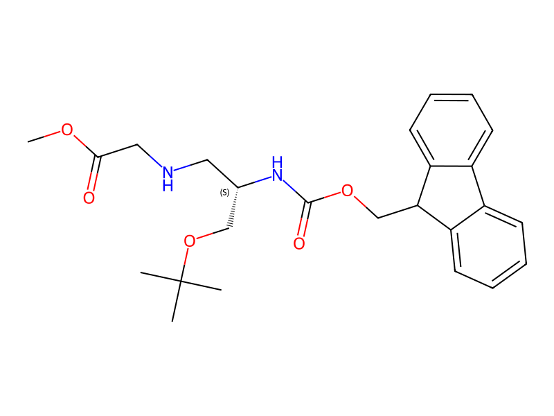

* **Systematic IUPAC Name**: methyl N-((R)-2-((((9H-fluoren-9-yl)methoxy)carbonyl)amino)-3-(tert-butoxy)propyl)glycinate
* **Canonical SMILES**: `CC(C)(C)OC[C@H](CNCC(=O)OC)NC(=O)OCC1c2ccccc2-c3ccccc31`
* **Functional Role & Operational Specification**: Chiral D-serine pseudopeptide backbone (MW 440.54 Da) (Step 3).
* **Reference Document & Synthesis Step**: PS_Gamma Ser Monomers Step 3

### L-γ-Boc-Ser-PNA-OMe (Compound 5a)
DST-SER-009&nbsp;
C₃₀H₄₀N₂O₇ &bull; 540.66 Da&nbsp;

  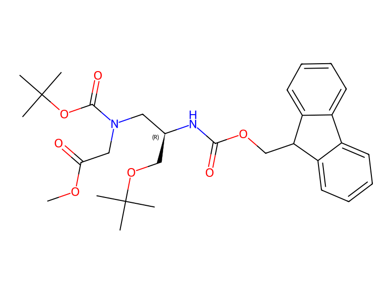

* **Systematic IUPAC Name**: methyl N-((S)-2-((((9H-fluoren-9-yl)methoxy)carbonyl)amino)-3-(tert-butoxy)propyl)-N-(tert-butoxycarbonyl)glycinate
* **Canonical SMILES**: `CC(C)(C)OC[C@@H](CN(CC(=O)OC)C(=O)OC(C)(C)C)NC(=O)OCC1c2ccccc2-c3ccccc31`
* **Functional Role & Operational Specification**: Boc-protected methyl ester intermediate towards *L-Ser* abasic monomer (Step 4).
* **Reference Document & Synthesis Step**: PS_Gamma Ser Monomers Step 4

### D-γ-Boc-Ser-PNA-OMe (Compound 5b)
DST-SER-010&nbsp;
C₃₀H₄₀N₂O₇ &bull; 540.66 Da&nbsp;

  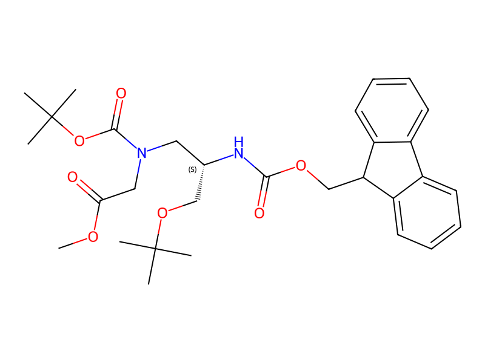

* **Systematic IUPAC Name**: methyl N-((R)-2-((((9H-fluoren-9-yl)methoxy)carbonyl)amino)-3-(tert-butoxy)propyl)-N-(tert-butoxycarbonyl)glycinate
* **Canonical SMILES**: `CC(C)(C)OC[C@H](CN(CC(=O)OC)C(=O)OC(C)(C)C)NC(=O)OCC1c2ccccc2-c3ccccc31`
* **Functional Role & Operational Specification**: D-enantiomeric Boc-protected methyl ester intermediate towards *D-Ser* (Step 4).
* **Reference Document & Synthesis Step**: PS_Gamma Ser Monomers Step 4

### Blank Monomer - *D-Ser* (Compound 6b / Boc-γ-D-Ser(tBu)-PNA-COOH)
DST-SER-011&nbsp;
C₂₉H₃₈N₂O₇ &bull; 526.63 Da&nbsp;

  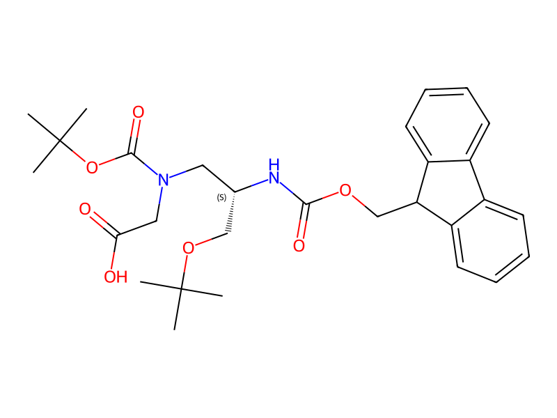

* **Systematic IUPAC Name**: N-((R)-2-((((9H-fluoren-9-yl)methoxy)carbonyl)amino)-3-(tert-butoxy)propyl)-N-(tert-butoxycarbonyl)glycine
* **Canonical SMILES**: `CC(C)(C)OC[C@H](CN(CC(=O)O)C(=O)OC(C)(C)C)NC(=O)OCC1c2ccccc2-c3ccccc31`
* **Functional Role & Operational Specification**: Chiral (R)-D-serine abasic blank monomer (RP-HPLC CBU-2 Tr = 6.459 min) (Step 5).
* **Reference Document & Synthesis Step**: PS_Gamma Ser Monomers Step 5 & Table 2

## 9. PEGylated, Cationic & Modified PNA Monomers (Analytical Table 2)

### Cpeg (Fmoc-γ-(mini-PEG)-C(Bhoc)-PNA-OH)
DST-MOD-001&nbsp;
C₄₆H₄₉N₅O₁₁ &bull; 847.92 Da&nbsp;

  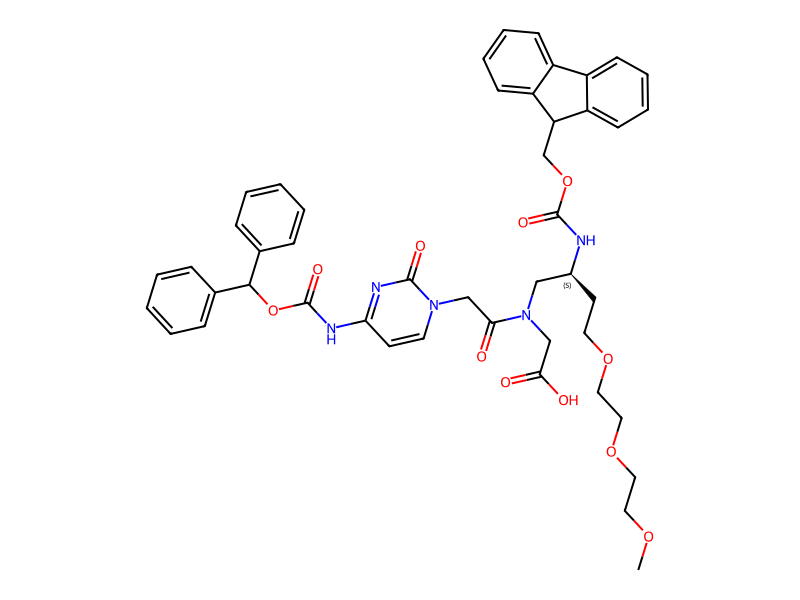

* **Systematic IUPAC Name**: N-(2-(4-(((benzhydryloxy)carbonyl)amino)-2-oxopyrimidin-1(2H)-yl)acetyl)-N-((S)-2-((((9H-fluoren-9-yl)methoxy)carbonyl)amino)-4-(2-(2-methoxyethoxy)ethoxy)butyl)glycine
* **Canonical SMILES**: `COCCOCCOCC[C@@H](CN(CC(=O)O)C(=O)Cn1ccc(NC(=O)OC(c2ccccc2)c3ccccc3)nc1=O)NC(=O)OCC4c5ccccc5-c6ccccc64`
* **Functional Role & Operational Specification**: Solubilizing PEGylated cytosine PNA monomer preventing probe aggregation (RP-HPLC CBU-2 Tr = 6.073 min).
* **Reference Document & Synthesis Step**: Table 2 PS_Gamma Glu & PS_Gamma Ser

### Tpeg (Fmoc-γ-(mini-PEG)-T-PNA-OH)
DST-MOD-002&nbsp;
C₃₃H₄₀N₄O₁₀ &bull; 652.70 Da&nbsp;

  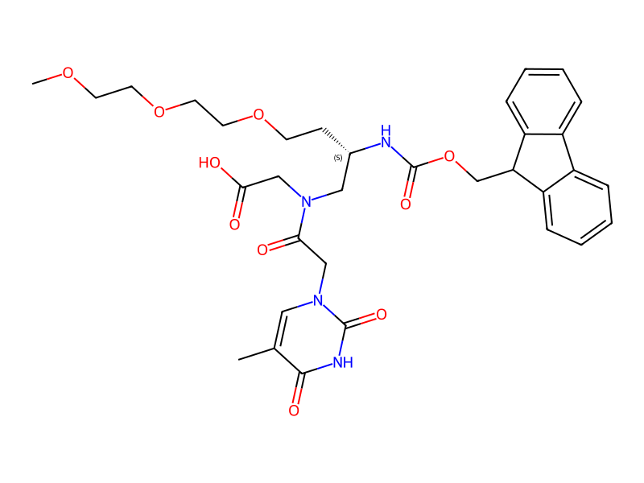

* **Systematic IUPAC Name**: N-((S)-2-((((9H-fluoren-9-yl)methoxy)carbonyl)amino)-4-(2-(2-methoxyethoxy)ethoxy)butyl)-N-(2-(5-methyl-2,4-dioxo-3,4-dihydropyrimidin-1(2H)-yl)acetyl)glycine
* **Canonical SMILES**: `COCCOCCOCC[C@@H](CN(CC(=O)O)C(=O)Cn1cc(C)c(=O)[nH]c1=O)NC(=O)OCC2c3ccccc3-c4ccccc42`
* **Functional Role & Operational Specification**: Solubilizing PEGylated thymine PNA monomer (RP-HPLC CBU-2 Tr = 5.223 min).
* **Reference Document & Synthesis Step**: Table 2 PS_Gamma Glu & PS_Gamma Ser

### Clys (Fmoc-γ-L-Lys(Boc)-C(Bhoc)-PNA-OH)
DST-MOD-003&nbsp;
C₄₈H₅₂N₆O₁₀ &bull; 872.98 Da&nbsp;

  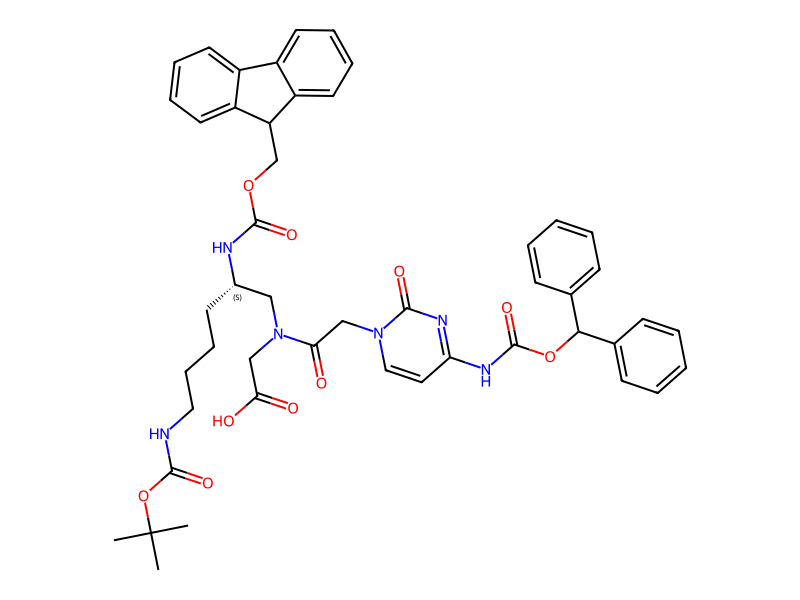

* **Systematic IUPAC Name**: N-(2-(4-(((benzhydryloxy)carbonyl)amino)-2-oxopyrimidin-1(2H)-yl)acetyl)-N-((S)-2-((((9H-fluoren-9-yl)methoxy)carbonyl)amino)-6-((tert-butoxycarbonyl)amino)hexyl)glycine
* **Canonical SMILES**: `CC(C)(C)OC(=O)NCCCC[C@@H](CN(CC(=O)O)C(=O)Cn1ccc(NC(=O)OC(c2ccccc2)c3ccccc3)nc1=O)NC(=O)OCC4c5ccccc5-c6ccccc64`
* **Functional Role & Operational Specification**: Cationic lysine-modified cytosine PNA monomer conferring positive charge post-cleavage (RP-HPLC CBU-2 Tr = 6.389 min).
* **Reference Document & Synthesis Step**: Table 2 PS_Gamma Glu & PS_Gamma Ser

### Tlys (Fmoc-γ-L-Lys(Boc)-T-PNA-OH)
DST-MOD-004&nbsp;
C₃₅H₄₃N₅O₉ &bull; 677.76 Da&nbsp;

  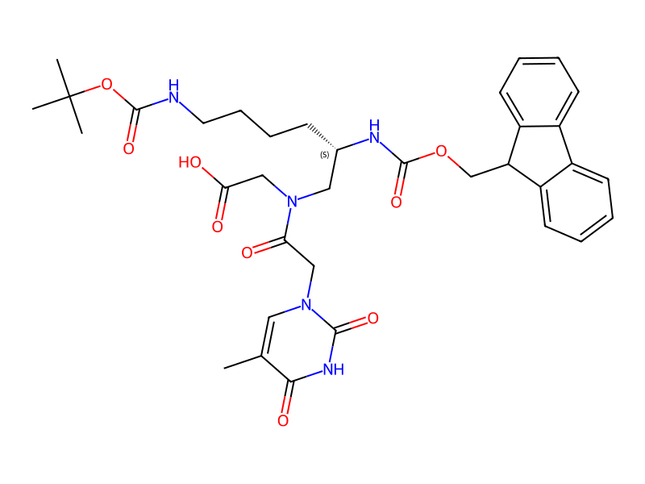

* **Systematic IUPAC Name**: N-((S)-2-((((9H-fluoren-9-yl)methoxy)carbonyl)amino)-6-((tert-butoxycarbonyl)amino)hexyl)-N-(2-(5-methyl-2,4-dioxo-3,4-dihydropyrimidin-1(2H)-yl)acetyl)glycine
* **Canonical SMILES**: `CC(C)(C)OC(=O)NCCCC[C@@H](CN(CC(=O)O)C(=O)Cn1cc(C)c(=O)[nH]c1=O)NC(=O)OCC2c3ccccc3-c4ccccc42`
* **Functional Role & Operational Specification**: Cationic lysine-modified thymine PNA monomer conferring positive charge (RP-HPLC CBU-2 Tr = 5.627 min).
* **Reference Document & Synthesis Step**: Table 2 PS_Gamma Glu & PS_Gamma Ser

### Blank Monomer - *L-DAPA* (Fmoc-γ-L-DAPA(Boc)-Blank-PNA-COOH)
DST-MOD-005&nbsp;
C₃₀H₃₉N₃O₈ &bull; 569.66 Da&nbsp;

  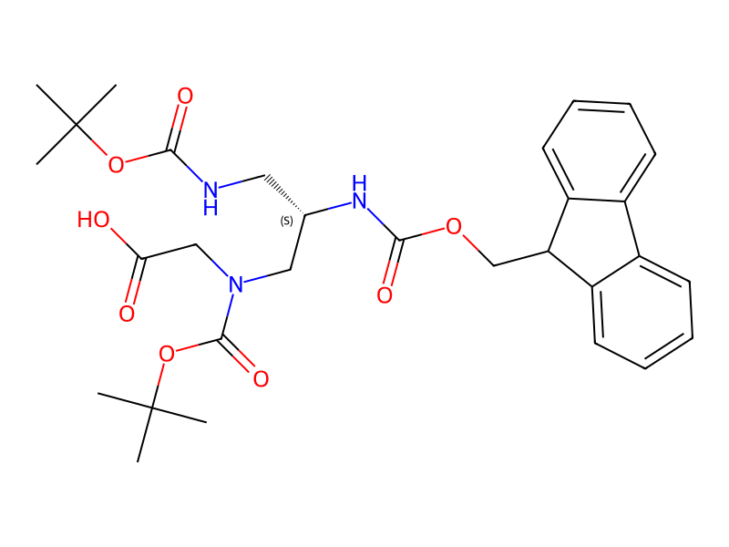

* **Systematic IUPAC Name**: N-((S)-2-((((9H-fluoren-9-yl)methoxy)carbonyl)amino)-3-((tert-butoxycarbonyl)amino)propyl)-N-(tert-butoxycarbonyl)glycine
* **Canonical SMILES**: `CC(C)(C)OC(=O)NC[C@@H](CN(CC(=O)O)C(=O)OC(C)(C)C)NC(=O)OCC1c2ccccc2-c3ccccc31`
* **Functional Role & Operational Specification**: Chiral (S)-L-diaminopropionic acid abasic monomer for amine functionalization (RP-HPLC CBU-2 Tr = 6.232 min).
* **Reference Document & Synthesis Step**: Table 2 PS_Gamma Glu & PS_Gamma Ser

### Blank Monomer - *D-DAPA* (Fmoc-γ-D-DAPA(Boc)-Blank-PNA-COOH)
DST-MOD-006&nbsp;
C₃₀H₃₉N₃O₈ &bull; 569.66 Da&nbsp;

  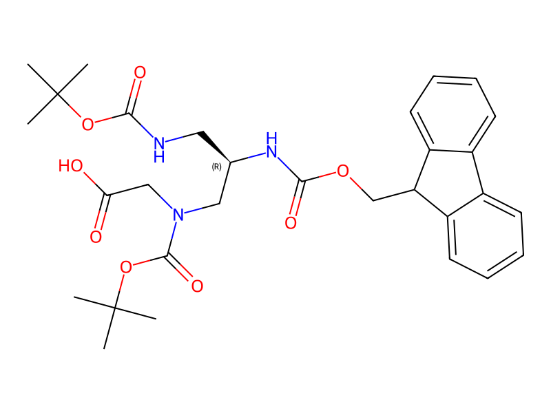

* **Systematic IUPAC Name**: N-((R)-2-((((9H-fluoren-9-yl)methoxy)carbonyl)amino)-3-((tert-butoxycarbonyl)amino)propyl)-N-(tert-butoxycarbonyl)glycine
* **Canonical SMILES**: `CC(C)(C)OC(=O)NC[C@H](CN(CC(=O)O)C(=O)OC(C)(C)C)NC(=O)OCC1c2ccccc2-c3ccccc31`
* **Functional Role & Operational Specification**: Chiral (R)-D-diaminopropionic acid abasic monomer (RP-HPLC CBU-2 Tr = 6.232 min).
* **Reference Document & Synthesis Step**: Table 2 PS_Gamma Glu & PS_Gamma Ser

### Hy (Fmoc-Hy-OH / Hydroxyethylglycine Spacer)
DST-MOD-007&nbsp;
C₁₉H₁₉NO₅ &bull; 341.36 Da&nbsp;

  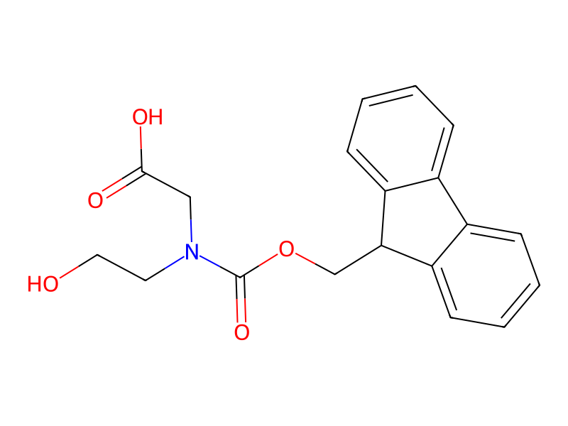

* **Systematic IUPAC Name**: 2-((((9H-fluoren-9-yl)methoxy)carbonyl)(2-hydroxyethyl)amino)acetic acid
* **Canonical SMILES**: `O=C(O)CN(CCO)C(=O)OCC1c2ccccc2-c3ccccc31`
* **Functional Role & Operational Specification**: Hydroxyethylglycine flexible spacer monomer (RP-HPLC CBU-2 Tr = 5.841 min).
* **Reference Document & Synthesis Step**: Table 2 PS_Gamma Glu & PS_Gamma Ser

## 10. Specialized Synthesis Reagents & Organics

### Dess-Martin Periodinane (DMP)
DST-SYN-001&nbsp;
C₁₃H₁₃IO₈ &bull; 424.14 Da&nbsp;
CAS: 87413-09-0

  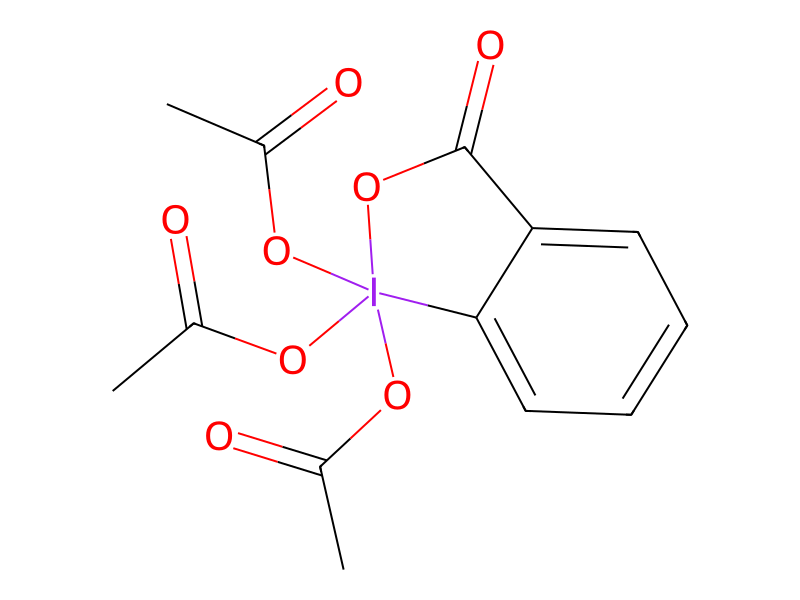

* **Systematic IUPAC Name**: 1,1,1-triacetoxy-1,1-dihydro-1,2-benziodoxol-3(1H)-one
* **Canonical SMILES**: `CC(=O)OI1(C2=CC=CC=C2C(=O)O1)(OC(=O)C)OC(=O)C`
* **Functional Role & Operational Specification**: Mild hypervalent iodine oxidant enabling racemization-free conversion of amino alcohols to α-amino aldehydes in wet DCM.
* **Reference Document & Synthesis Step**: PS_Gamma Glu Step 1 & PS_Gamma Ser Step 2

### Sodium Cyanoborohydride (NaBH3CN)
DST-SYN-002&nbsp;
CH₃BNNa &bull; 62.84 Da&nbsp;
CAS: 25895-60-7

  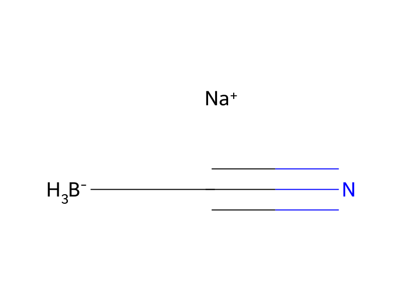

* **Systematic IUPAC Name**: sodium cyanoborohydride
* **Canonical SMILES**: `[Na+].[BH3-]C#N`
* **Functional Role & Operational Specification**: Chemoselective reducing agent for reductive amination of α-amino aldehydes with glycine methyl ester.
* **Reference Document & Synthesis Step**: PS_Gamma Glu Step 2 & PS_Gamma Ser Step 3

### Isobutyl Chloroformate (IBCF)
DST-SYN-003&nbsp;
C₅H₉ClO₂ &bull; 136.58 Da&nbsp;
CAS: 543-27-1

  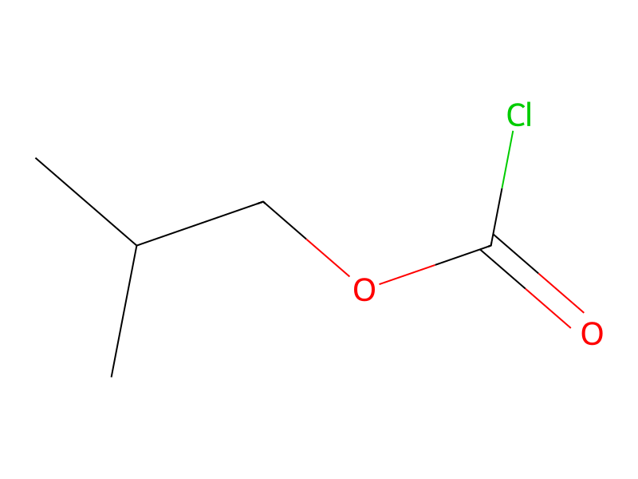

* **Systematic IUPAC Name**: isobutyl carbonochloridate
* **Canonical SMILES**: `CC(C)COC(=O)Cl`
* **Functional Role & Operational Specification**: Reagent for generating mixed carbonic anhydrides for reduction of carboxylic acids to alcohols with NaBH4.
* **Reference Document & Synthesis Step**: PS_Gamma Ser Step 1

### Glycine Methyl Ester Hydrochloride
DST-SYN-004&nbsp;
C₃H₈ClNO₂ &bull; 125.56 Da&nbsp;
CAS: 5680-79-5

  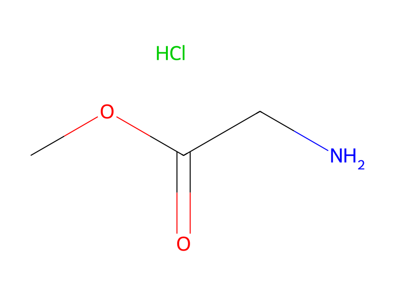

* **Systematic IUPAC Name**: methyl 2-aminoacetate hydrochloride
* **Canonical SMILES**: `COC(=O)CN.Cl`
* **Functional Role & Operational Specification**: Primary amine building block forming the glycine segment of the pseudopeptide PNA backbone.
* **Reference Document & Synthesis Step**: PS_Gamma Glu Step 2 & PS_Gamma Ser Step 3

---

## Compliance & Institutional Certification
This technical specification catalogue has been compiled under quality assurance guidelines in accordance with:
* **UNE-EN ISO 9001:2015**: Quality Management Systems — Requirements.
* **UNE-EN ISO 13485:2016**: Medical Devices — Quality Management Systems — Requirements for Regulatory Purposes.
* **DestiNA Synthesis Operating Protocols**: PT-SQ-001, PS_Gamma Glu Monomers Rev 1, SOP_EE-GAMMA-GLU-MONOMERS Rev 0, PS_Gamma Ser Monomers Rev 1, and SPPS Quality Guide Rev 1.

*Document certified for laboratory execution, automated synthesizer integration, and regulatory technical dossiers.*